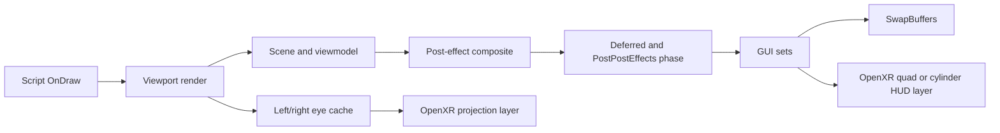

# Future Systems Reverse Engineering

## 0.68.0 Native Analog And Single-Render Terminal Correction

The complete 0.67 log separates controller geometry from delivery. Slide state
`4` accumulated up to hundreds of synthetic mouse pixels and substantial signed
hand displacement, yet curtains did not move. Ghidra resolves the correct
boundary at `0x140154fb0`: `cLuxPlayer::OnAnalogInput(int,const cVector3f&)`
dispatches first to the current player-state script at player `+0xc8`, then the
secondary handler at `+0xf0`, then player-level analog handling. SOMAVR now calls
this guarded dispatcher directly with analog type `0` (`eAnalogType_Look`).
State `13` MovingButton is included because released
`PlayerState_Interact_MovingButton.hps` consumes Look analog and reverses its
required direction internally as the authored mechanism changes state. Script
motion, locks, callbacks, and sounds therefore remain authoritative.

Terminal cursor telemetry already showed changing coordinates and successful
dispatch through manager world owner `+0x170`. The visual failure was in
presentation: `HPL3_GuiSet_Render` was called once for the physical FBO and again
for HUD capture, doubling stateful draw work and producing fragmented/flashing
content. Version 0.68 renders once, then blits the completed nonzero terminal FBO
to the HUD capture. Cursor ownership and native widget dispatch are unchanged.

SOMA's Grab throw script teleports the prop immediately in front of the camera,
zeros velocity, and then applies a camera-forward native impulse. Arbitrary
controller redirection could point that fresh prop back through the character,
causing recoil, while the old `0.5..1.5` speed scale weakened ordinary throws.
The new policy preserves at least native magnitude, permits up to `2x` for fast
motion, and enforces a small forward-clearance component.

Read presentation now scales each current native matrix translation from the
current camera position. This is intentionally not an acquisition-frame cache:
the earlier cached route replaced SOMA's evolving entrance trajectory and caused
the slow distant slide. A scale of `2` changes the observed `0.15` metre settle
distance to approximately `0.30` metres without changing native timing.

## 0.67.0 Native Manipulation And Terminal Overlay Correction

The complete 0.66 log changes the terminal diagnosis. State `8` produced
successful native cursor dispatch, including `applied=242` and `dispatch=120`,
through manager world-input owner `+0x170`. Control felt absent because the
selected-controller ray repeatedly missed the small physical laptop mesh and
released the pointer. The same log identifies the exact focused terminal set:
flat `is3d=0`, virtual size `1024x577`, rendered into FBOs `17/18` with 17--28
draw calls. Version 0.67 preserves that physical render, then replays only this
focused set through the additive OpenXR HUD capture while state `8` owns it.
The existing terminal input bridge maps aim over the head-locked panel and still
dispatches through native `HPL3_ImGui_SendMouseVirtualPosition`.

Released `script/player/PlayerState_Interact_Slide.hps` establishes the curtain
contract. `OnAnalogInput(eAnalogType_Look)` accumulates `mvMoveAdd`; `Update`
projects camera up/right through that value onto the joint pin, then applies
native factors, lock logic, sounds, and callbacks. Direct body velocity bypasses
this script contract. It also explains the live snap-turn behavior: turn input
accidentally supplied the Look delta that the curtain expected. Version 0.67
therefore packages the existing controller-manipulation mouse/Look bridge and
keeps direct Slide PID control disabled unless explicitly requested.

Released `PlayerState_Interact_Grab.hps` confirms authored per-prop offset/depth,
minimum/maximum depth, force/torque multipliers, heavy flags, chain length, speed
limits, and sticky-parent rotation. SOMAVR's correction path was clamping
`initialHandCorrection + controllerMovement`; mug/DSLR anchors often began beyond
the old `0.75` metre cap, leaving no travel after pull-in. The corrected contract
preserves the initial selected-hit-to-hand correction and clamps only subsequent
controller movement. Absolute orientation error remains bounded, but the response
cap returns to SOMA's native `6 rad/s`.

The installed `Soma.exe` imports `steam_api64.dll` and Steam API entry points;
`Soma_NoSteam.exe` does not. A fuzzy Ghidra match maps NoSteam
`SOMA_GetClosestEntity` `0x1400cd750` to Steam `0x1400cf560`, confirming native
layout drift. The injector's NoSteam signature doctor rejects the Steam build,
so current control hooks must not be applied to `Soma.exe`. The shipped developer
batch files are useful for their `-user Dev -cfg config/main_init_dev.cfg` and
map arguments, but target the unsupported Steam executable. SOMAVR now packages
an equivalent NoSteam developer launcher.

## 0.66.0 Interaction Stability Correction

The 0.65.1 log proves story-object presentation is materially improved and
isolates the remaining loose-prop jitter. Immediately after Grab anchoring, one
body reported angular velocity `109.30,-8.05,-47.04 rad/s`; subtracting that
unbounded value from a target capped at `6 rad/s` handed the native `40/0/0.4`
PID another three-digit reversal. Version 0.66 bounds the complete angular error
vector and packages lower `20/3` gain/speed defaults. The absolute full-axis pose
target remains, but light bodies cannot receive arbitrarily large corrective
torque through this hook.

Curtain evidence reaches Slide state `4`, resolves pin
`0.03589,0,0.99936`, and accelerates the body only to about `0.24` while the
hand reaches `0.68` world units/second. The former velocity-only route discards
the remaining hand/body gap as soon as hand velocity falls. Version 0.66 anchors
initial grip and body positions, projects both displacements onto the native pin,
and adds configurable proportional catch-up to velocity feed-forward before the
same native Slide PID and joint limits.

Terminal state `8` remained active for roughly 740 frames, but no
`hpl_terminal_pointer applied` row appeared and the pointer-active gate repeatedly
flipped. Decompilation of `SOMA_ImGuiManager_UpdateInput` identifies the mismatch:
world input uses manager `+0x170`, while the bridge validated a separate current-
ImGui helper. The native world branch reads focused wrapper `+0x180`, cGuiSet
`+0x18`, entity `+0x28`, projects the ray, then calls
`HPL3_ImGui_SendMouseVirtualPosition` on `+0x170`. Version 0.66 mirrors that
ownership for both direct dispatch and hook substitution, so subsequent native
mouse updates cannot overwrite controller coordinates.

## 0.65.1 Object Rotation Correction

The 0.65 live log resolves both reported hard limits. Read's first intercepted
matrix was only `0.4586` world units from camera; the next native animation frame
had already moved to `0.8842`. Caching and doubling the first sample therefore
forced every later native direction onto a fixed `0.9171` radius, producing the
slow distant slide. Released `PlayerState_Interact_Read.hps` also confirms a
native `1.3` radian entrance tilt, two-axis Look/Move rotation, and a hard
`+/-pi/8` `mfRotY` clamp. Version 0.65.1 preserves every native translation and
replaces only the displayed basis after grip engagement with a persistent
controller-relative quaternion. This removes the clamp without taking camera
ownership or altering Read state/cancel callbacks.

Grab's logged native and controller targets repeatedly became near-exact
opposites at the shared `6 rad/s` cap. HPL2 source confirms the native loop
computes `wantedAngularVelocity - body.GetAngularVelocity()` before PID
`40/0/0.4|0.1`; adding another target to that error cannot represent an absolute
hand pose. Ghidra identifies `iPhysicsBody::GetLocalMatrix` at `0x1404a9a40`
(`body+0x50`) and the `GetAngularVelocity` virtual thunk at `0x1401b0710`
(vtable `+0x90`, hidden vector return buffer in `RDX`). Version 0.65.1 anchors
body orientation to controller world orientation, computes the desired body pose
from the full controller delta, subtracts measured body angular velocity, and
feeds that error to SOMA's existing PID. Native mass, inertia, collision,
gravity, joints, limits, sounds, and interaction lifecycle remain authoritative.

## 0.65.0 Physical Interaction Polish Result

The 0.64.1 log proves the terminal mesh-ray route reached state `8`, but
`hpl_terminal_pointer applied` never appeared. `0x1402f0c90` is both the virtual
cursor state writer and the GUI event boundary; waiting for a native mouse-motion
call therefore left a controller-only session inert. Version 0.65 dispatches the
projected virtual position directly through the original function once per mesh
hit. Native `cGuiSet` focus, widget dispatch, clicks, sounds, and callbacks remain
unchanged.

Released `PlayerState_Interact_Read.hps` confirms Read uses
`eAction_InteractCancel`, exits on its state timer, and scales its generated prop
with `gfReadableDistScale=0.5` and `gvReadableScale=(0.5,0.5,0.5)`. The prior
same-tick right-mouse down/up could be missed by the script update. Version 0.65
holds right mouse while right A/B is held, adds squeeze hysteresis to Read
rotation, and intercepts only nearby non-special state-10 `SetMatrix` candidates.
The first native distance is cached per entity; translation moves it to twice
that distance and the basis is normalized to twice apparent scale. Destroy-time
eviction prevents stale entity reuse. Live identity and visual acceptance remain
mandatory before this becomes a proven Read ownership contract.

SwingDoor/Lever scripts still source their torque intent from mouse-derived
camera axes, but OpenXR supplies tracked grip angular velocity directly. Version
0.65 projects that world angular velocity onto joint pin `+0xe8`, combines it
with the existing `(r x v) dot axis / |r|^2` translation term, and applies the
shared native speed cap before the torque PID. This adds the missing wrist-twist
degree of freedom without replacing joint limits, callbacks, sounds, or physics.

The loose-prop path follows SS2VR's select/pull/hold/release decomposition while
retaining SOMA's native solver. A fresh selected hit point supplies a bounded
initial hand correction to Grab's existing PID error; subsequent tracked hand
deltas, collision response, two-hand rotation, and release impulse remain native.
This is a conservative gravity-glove pull, not a long-range teleport or scripted
catch. Finally, an interaction-owner lock freezes the selected hand throughout
states `1..7` and `10`, preventing crossed rays from transferring a live native
object while preserving either-hand acquisition between interactions.

## 0.64.0 Dual-Hand Interaction Result

The outer closest-entity wrapper at `0x1400cd750` is not safe to call twice for
one gameplay focus update because it invokes the result object's vtable `+0x40`
finalizer. Its inner native raycast at `0x1401438c0` writes only distance, body,
and entity out fields. Version 0.64 probes that inner function once per tracked
hand into local candidates, deterministically selects one, copies only that
candidate to the real result, and finalizes once. This preserves SOMA's single
focus/`CanInteract`/callback lifecycle while enabling either hand.

Selected-hand identity is latched with the input frame and consumed by input,
Grab/Slide/hinge/Read control, terminal clicks, and Grab contact haptics. The
visual path keeps one guide state per hand and uses a dedicated guide swapchain;
the semantic native icon remains in its own swapchain at selected hit depth.
Headset evidence must now settle overlap stability, callback singularity, layer
capacity, and initiating-hand continuity through all physical player states.

## 0.63.0 Diegetic Terminal Takeover Result

Released `PlayerState_Interact_Terminal.hps` identifies all three parts of the
wall-terminal camera takeover: `iCharacterBody::SetFeetPosition`,
`cLuxPlayer::RotateCameraTowards`, and camera-add type Terminal `4`. Version
0.63 signature-guards those exact native boundaries and suppresses them only
while F10 tracking and live player state `8` agree. State `9` is deliberately
excluded because its handheld prop-to-camera presentation has separate ownership.

`SOMA_ImGuiManager_UpdateInput` reaches a native spatial projector at
`0x1403132d0`. It intersects the focused `cGuiSetEntity` mesh, barycentrically
interpolates UV set `7`, and multiplies by cGuiSet virtual dimensions
`+0x100/+0x104`. Version 0.63 reuses this function with the calibrated dominant
controller world ray. Hits become exact virtual cursor coordinates; misses
deactivate the pointer, while unavailable spatial ownership alone falls back to
the older head-cone projection. SOMA continues to own focus, widgets, sounds,
click dispatch, callbacks, and exit.

## 0.62.0 Physical Hinge And Timing Result

The 0.61 log proves Slide was receiving direction rather than velocity. Every
`controllerVelocity` vector had magnitude approximately one because
`ResolveHPLReferenceVectorWorld` used the normalized direction transform. The
reference-space conversion now uses the offset/vector transform so gentle and
fast motion remain distinguishable before native joint projection and clamps.

SwingDoor state `5` and Lever state `6` use the RotateBase torque PID tuple
`10/0/1`, but their shipped scripts synthesize torque from mouse X/Y and camera
Up/Forward/Right. This makes mechanism motion depend on view yaw and snap-turn.
The registered `iPhysicsJoint::GetPivotPoint()` leaf at `0x1401822e0` returns
`joint+0xf4`; paired with pin `joint+0xe8`, it closes a camera-independent route.
Version 0.62 anchors the native hit point, follows controller translation, and
computes signed angular velocity as `(r x v) dot axis / |r|^2`. It adds that
velocity only to the native PID axis, preserving SOMA's mechanism authority.

Timing evidence clears same-frame XR scheduling as the primary stutter source:
194 valid eye pairs averaged 2.61 ms separation, p95 was 4.36 ms, maximum was
12.29 ms, and pose-frame gaps remained zero. The prior diagnostic counted
comparisons against the other eye from the previous frame, which naturally
measured roughly 51-100 ms. The capture also emitted thousands of synchronously
flushed stage, CPU/GPU query, resource, and uniform rows. Version 0.62 corrects
the pair classifier, batches normal logs, and disables those completed probes in
the active profile. A headset comparison remains the acceptance gate.

## 0.61.0 Native Manipulation Result

The 0.60 log resolved the Slide failure. `PlayerState_Interact_Slide.hps`
converts only mouse X/Y into camera right/up before projecting that vector onto
the joint pin. A drawer or curtain whose pin contains camera-forward therefore
cannot be driven by real controller depth; changing camera yaw alters the basis,
which is why snap turn appeared to move the object.

Native decompilation closes the 3D route. The closest-entity wrapper's true
output order is distance `+0x18`, physics body `+0x20`, entity `+0x28`.
`iPhysicsBody::GetJoint(0)` reads the pointer vector at `+0x168/+0x170`, and
registered `iPhysicsJoint::GetPinDir()` returns `joint+0xe8`. Slide's force PID
is the exact `6/0/0.1` tuple already crossing `0x140238750`. Version 0.61 adds
controller velocity projected onto that pin to the native velocity error, while
leaving the script's PID and all body/joint ownership intact.

Read state now maps reference-space grip orientation deltas to native Look and
records unique non-special entities receiving `SetMatrix` within 1.5 world units
of the camera. The resulting `hpl_read_entity_candidate` identity/matrix rows
are the required evidence for safely replacing only the generated open prop's
matrix with a right-controller grip transform. The shipped constants
`gfReadableDistScale=0.5` and `gvReadableScale=(0.5,0.5,0.5)` explain the current
small, close presentation; they remain native until open-prop ownership is
confirmed.

The runtime requests `2688x2880` per eye with recommended sample count 1, but
each stereo cache is populated from SOMA's `1920x1080` backbuffer. Future image
quality work needs a larger native or offscreen HPL render target (plus measured
post-AA compatibility), not a larger compositor swapchain alone. The active
SOMA profile has `EdgeSmooth="false"`, and the game menu exposes Off/FXAA, so
source anti-aliasing was disabled during this capture; that is separate from the
OpenXR swapchain's one-sample recommendation.

## 0.60.0 Evidence Capture Plan

Static ownership is now sufficient to instrument the remaining uncertain live
boundaries without adding another native mutation. The 0.60 build preserves the
accepted 0.59 path and records four missing correlations automatically:

- eye-cache capture separation and per-eye age at XR submission;
- raw versus calibrated controller-relative movement transforms;
- closest-entity hit/payload transitions paired with native crosshair semantics;
- current-ImGui player-state ownership and hand-travel-to-mouse-pixel sessions.

This evidence decides whether the next implementation belongs in XR scheduling,
interaction payload decoding, Read/Zoom HUD capture/presentation, or per-state
manipulation scaling. It also prevents tuning from subjective symptoms alone.

## 0.59.0 Live Usability Result

The 0.58 live run is the first broad acceptance pass over the integrated VR
stack. Tracking, stereo geometry, eye height, shadows, reflections, and shader
compatibility remained visually stable. Continuous same-frame stereo removed a
small perceived eye-to-eye delay, so 0.59 makes it the packaged default and
records the exact rendered pose-frame gap for each submitted stereo pair. AFR
remains the panel/config rollback.

The clipped interaction icon and recurring missing center square were not a
shader fault: `OpenXRGLBridge::EndHudCapture` was clearing a 96x96 scissored
square around the GameHud center. Since the native hit snapshot was not decoded
in this run (`interactionReticleUpdates=0`), that clear removed useful native UI
without a compositor replacement. The active profile now preserves the full HUD.
A temporary controller aim guide publishes three application-space markers from
the dominant aim pose and yields automatically once the true semantic reticle
has a fresh world hit.

Shipped player scripts confirm Read state `10` exits through native right-click
`InteractCancel` and rotates from look/analog input. Terminal states `8/9` share
the cancel route. The controller bridge now maps dominant Secondary to that
native action and converts grip-held Read displacement to the existing mouse-
look path. Slide state `4` already reached `RotateBase::OnAnalogInput`, but live
motion was about one third physical scale; it now has an independent 2700 px/m
mapping while Wheel/Door/Lever/Tear retain 900 px/m.

Comfort-vignette submission was healthy and ordered last, with zero submission
failures and full motion levels. Its invisibility on Quest 3 was therefore a
coverage/alpha issue. The test profile expands the quad to roughly 127 degrees,
uses inner radius `0.32`, and reports its exact angular width. A future
projection-space per-eye mask is justified only if this visible calibration
still cannot cover the runtime FOV cleanly.

The requested fixed-foveation path did not become operational: Virtual Desktop
did not expose the complete FB swapchain-update/foveation extension set. This is
a correct native-swapchain fallback, not a successful foveation test.

## 0.58.0 Native Grab-Contact Haptics Result

Ghidra confirms `cPhysicsWorldNewton::Update` at `0x1405548b0` consumes each
`0x60`-byte contact record after Newton simulation. Normal speed at `+0x18`,
tangent speed at `+0x1c`, contact position at `+0x2c`, body pointers at
`+0x38/+0x40`, material pointers at `+0x48/+0x50`, and contact count at `+0x58`
feed material-priority dispatch. Released HPL2 source independently matches the
same `OnImpact` and `OnSlide` call sequence and signatures.

`HPL3_cSurfaceData_OnImpact` (`0x14032f0e0`) is the narrow, low-frequency event
boundary. `0.58.0` preserves it completely, then requires exact Grab state `1`,
a fresh tracked dominant grip, non-authored camera ownership, and a contact
point within a configurable radius. Native normal speed maps linearly to one
bounded OpenXR pulse; a short cooldown folds the possible two material-side
callbacks into one contact. Weak, distant, stale, and invalid events remain
silent. This supplies physical-object contact feedback without manufacturing
physics or touching SOMA's sound, particles, callbacks, or gamepad behavior.

Material priority means the `OnImpact` body argument is not guaranteed to be
the grabbed side for every pair, so proximity is intentionally part of the
ownership contract. Live false-positive evidence should precede any deeper
Grab-state layout mutation. `HPL3_cSurfaceData_OnSlide` (`0x14032f380`) exposes
tangent speed and both bodies for possible sustained scrape haptics, but remains
unhooked until impact feedback proves useful and a quiet refresh policy is
measured.

## 0.48.0 Controller Profile Result

OpenXR input now suggests five standard profiles: Khronos Simple, Oculus Touch,
Valve Index, Microsoft Motion Controller, and HTC Vive. Vive receives trackpad
locomotion/turn, trigger, squeeze, menu, poses, and haptics without changing the
existing dominant/support-hand policy.

`XR_TYPE_EVENT_DATA_INTERACTION_PROFILE_CHANGED` now triggers exact per-hand
`xrGetCurrentInteractionProfile` logging. The resolved profile survives in the
shutdown summary and resets with the session, providing direct evidence for
runtime switches, reconnects, and one-controller fallback. Device-specific
button tuning still requires live hardware evidence.

## 0.47.0 All-Stereo Previous-View Result

The confirmed previous-view bank now covers both stereo schedules. In AFR, the
single shared native packet would otherwise contain the opposite eye from the
immediately preceding game frame; in same-frame mode it would contain eye one
when eye two begins. `0.47.0` selects the matching bank before every exact-player
stereo viewport and validates the rendered eye afterward.

Temporal discontinuities are explicit: recenter/calibration generation changes,
renderer/history replacement, and pose-frame gaps greater than eight reseed both
eyes from live native state. This protects loading and tracking recovery without
inventing matrices. The same config switch restores fully native shared history.

## 0.46.0 Per-Eye Previous-View Result

The first temporal resource is now exact rather than inferred. At
`0x1401f1480`, HPL3 copies the active frustum view matrix (`+0x158`) into the
renderer history object's previous-view field (`+0x80`), exactly `0x40` bytes.
Released HPL2 source names the corresponding matrix `m_mtxPrevView`.

`HPLPerEyeViewHistory` banks this packet independently for left and right in
AFR and opt-in continuous exact-player stereo. It consumes the camera bridge's
pending eye before the viewport, restores history before world rendering, and
commits after native post-post capture only when the actual eye and pose frame
match. Identity changes seed/reset both banks; invalid memory or sequencing
faults closed to shared native history. Later builds own ImageTrail and temporal
SSAO per eye, frame-own ToneMapping and SSAO phase, and classify bloom and local
reflection as same-pass scratch. The `0.56.0` shipped shader/resource audit found
no separate previous-projection or render-velocity history.

## 0.45.0 Continuous Same-Frame Stereo Result

Ghidra reconfirmed `HPL3_Scene_RenderViewport` at `0x140298630` as the narrowest
complete player-eye boundary. `0.45.0` can now immediately preserve eye one and
replay only that exact player viewport with screen-GUI bit `2` removed. The
engine viewport enumerator at `0x140298850`, update/script lifecycle, renderer
frame/stat reset, GUI, XR submission, and presentation remain once per game
frame. The stateful post-post phase at `0x1401f1480` is necessarily repeated.

`HPLDualRenderControl` keeps this path explicit, off by default, available from
the F1 panel, and fail-closed. Eye-one cache failure or eye/pose-sequence mismatch
immediately disables it and restores AFR. Bounded automatic/manual replay arms
still take temporal mutation snapshots; ordinary continuous frames do not. This
is a built prototype awaiting headset visual, temporal, performance, and rollback
acceptance before it can replace AFR as the default.

## 0.44.0 Inventory Presentation Result

Shipped source fixes the inventory user-module ID at `15` and
`eAction_OpenInventory` at `12`. `InventoryHandler::OnAction` reacts only to a
pressed action `12`, calls `AutoEnable(3)`, and then fades its current-ImGui
surface at `0.6` alpha per second. A five-second capture authorization therefore
covers the complete authored hold and fade with a small scheduling margin.

Ghidra confirms the native `cLuxUserModule::OnAction` wrapper at `0x1401378e0`.
Its 26-byte body loads the script object from module `+0x90` and forwards action
and pressed state to the AngelScript dispatcher at `0x140129a40`. Registration
at `0x1401ae870` independently proves `int mlId` at module `+0x158`.
`HPLUserModuleBridge` preserves native dispatch, then publishes inventory
activity only for `(mlId=15, action=12, pressed=true)`. `HPLHudBridge` admits the
exact flat current-ImGui set only during that bounded window.

Main-menu activation calls `SetMenuActive`, which owns native pause state, so
the existing exact paused-current-ImGui route already covers it. Hints and
credits draw through GameHudImGui; descriptions, infection, crosshair, and
fullscreen white flashes draw through GameHudSet. `LightFlashHandler` owns a
world point light and must remain in stereo world rendering. These findings
avoid adding broad GUI or light interception for already-covered surfaces.

## 0.43.0 Scripted Presentation Result

Shipped script source establishes separate user modules for GameOver `10`, Wake
`12`, and Credits `19`. Wake is uniquely observable at an exact active boundary:
`Wake_SetAsleep` and `Wake_StartWakeup` call `cScript_RunGlobalFunc` with
`WakeHandler::_Global_SetAsleep/_Global_StartWakeup`. The registered bool and
float getters at `0x140485720/0x140485200` expose argument zero before dispatch.
The build therefore owns sleep blackout and only the authored-duration wake
capture window, not arbitrary user-module frames.

Game over has no equivalent global activation call, but `PlayerState_Dead` is
exact state `17`; its handler draws the black background, death note, localized
text, and continue prompt through current ImGui. State `17` safely authorizes
flat current-ImGui capture and a Jump-semantic controller continue while all
movement remains released. Credits explicitly call `GetGameHudImGui` and are
already included by unconditional GameHudImGui capture. `cLuxUserModule::OnGui`
at `0x1401297c0` remains a diagnostic/code-archeology anchor only because each
module callback can run and immediately return while inactive.

## 0.42.0 Native Gameplay Haptics Result

AngelScript registration binds `void SetRumble(int,float,float)` directly to
`SOMA_cLuxInputHandler_SetRumble` (`0x140109b30`). This wrapper receives device,
strength, and duration before checking whether SOMA currently has an eligible
physical gamepad. Shipped `Effect_Rumble_Start` callers include player damage
and death, attacks, locked interactions, datamining/tool progress, and authored
environment effects. The player damage wrapper at `0x14015bf50` therefore does
not need a narrower duplicate hook.

`0.42.0` preserves the original call and mirrors the authored envelope to both
OpenXR hands. Rising edges, material strength increases, and an 80 ms keepalive
emit at most 100 ms segments; intermediate per-frame calls are suppressed and
an authored zero transition calls `xrStopHapticFeedback`. Bilateral output is
intentional because SOMA's gamepad device index is not a VR-hand identity. Raw
physics contact and material-specific impacts are not claimed by this route and
still need a quiet, semantically filtered native owner.

## 0.41.0 Roomscale Body Reconciliation Result

Ghidra and both released HPL2 codebases agree on the native character-body
feet contract. `HPL3_CharacterBody_SetFeetPosition` (`0x140237920`) adds half
the size Y at body `+0x138` and calls the ordinary position setter;
`HPL3_CharacterBody_GetFeetPosition` (`0x140237970`) performs the inverse from
center position `+0x6c`. The full size vector begins at `+0x134`.

`0.41.0` turns that confirmed primitive into an optional, conservative
roomscale capsule catch-up path. It runs once per fresh HMD pose, only while
the unpaused Normal/Normal player state owns a readable body and the existing
head-volume safety query is valid and unclamped. Physical displacement must
remain beyond a 0.45 m threshold for 30 pose frames. The body then advances in
at most 0.015 m horizontal steps until the residual offset reaches 0.25 m.
Three height bands and a center/radial ring approximate the capsule sweep using
the confirmed world line query before every step.

Each accepted body step advances the HMD neutral position by the inverse
world-to-tracking transform. This removes the same displacement from the
rendered roomscale offset as the native capsule gains, preserving the world
camera position across the handoff. The native feet write uses `smooth=false`,
matching HPL2's documented teleport path that clears stale camera/entity
smoothing history. Loading, pause, authored cameras, special player/move
states, blocked head safety, malformed body data, and every signature failure
all fail closed without a write. Live acceptance remains mandatory because
the sampled sweep is not a recovered native shape cast.

## 0.38.0 Diegetic Terminal Input Result

Shipped `Prop_Terminal.hps` creates a world GUI, focuses it on interaction, and
changes the player to exact state `8`. `PlayerState_Interact_Terminal.hps`
moves/rotates the authored camera toward the terminal, suppresses look/move,
and returns focus to the prop on exit. This establishes a semantic owner without
guessing from draw calls.

Ghidra confirms that `SOMA_ImGuiManager_UpdateInput` (`0x1400f7f10`) sends world
GUI coordinates through `cImGui::SendMouseVirtualPosition` (`0x1402f0c90`), not
the ordinary pixel wrapper at `0x1402f0b10`. `0.38.0` hooks that exact virtual
boundary. Only states `8/9`, the exact current ImGui, a non-GameHud owner, and a
readable 3D cGuiSet may receive controller-derived coordinates. Coordinates use
the native virtual-size/offset transform; clicks remain SOMA's native left-mouse
route. All failed gates forward the original arguments unchanged.

`Prop_HandheldTerminal.hps` provides the equivalent high-confidence owner for
state `9`: it creates an open world prop, calls `CreateAndSetupGui`, and focuses
that prop when its authored lock-camera policy allows it. The same route is
therefore enabled for `8/9`, while exact current-owner and 3D-set gates reject
unfocused or differently authored variants. Version 0.63 supersedes the
head-relative approximation with SOMA's exact controller-ray-to-GUI-mesh UV
projection. The old route remains only as a fail-safe when the focused spatial
entity cannot be resolved.

## 0.29.0 Presentation And Authored-Optics Result

The registered FOV, FOV-multiplier, and aspect-multiplier functions are compact
leaf setters with exact player offsets. SOMAVR now replaces only their target
writes during active tracking, preserving native fade speed and restoring every
byte transactionally. The exact loading visibility wrapper is now a read-only
frame signal for persistent XR blackout, AFR invalidation, and input release.
`CreateVideo` and `DestroyVideo` are hooked only for bounded identity/lifetime
telemetry; live evidence must classify video ownership before presentation is
changed.

## 0.28.0 Authored-State Comfort Result

Shipped `Player_Types.hps` fixes roll IDs as Script `0`, Lean `1`, Move `2`,
and Climb `3`. Ghidra confirms exact wrappers at `0x140156d90`
(`FadeCameraRollTo`) and `0x140156f00` (`SetCameraRoll`). The new guarded policy
zeros only configured targets during active VR; the default active profile keeps
scripted roll and fade timing intact while suppressing lean, move, and climb
roll. This is semantic control above the camera transform, not a global roll
clamp.

The seven-byte `cWorld::SetDepthOfFieldActive` wrapper at `0x140071f80` writes
`world+0x264` and is followed by nine padding bytes. A reversible 16-byte patch
therefore disables only requested world DoF while tracking. Named post-effect
policy also includes exact type `VideoDistortion`; fades and tone mapping remain
native.

Player states Ladder `11`, ClimbLedge `12`, InteractiveCameraAnimation `14`,
Sit `15`, and Dead `17` now request a short OpenXR black frame on entry or exit.
This is a transition guard, not completed authored-camera composition. Live
tests still decide which states need longer/shorter guards and whether scripted
roll should ever be disabled per sequence.

## 0.27.0 Flashlight Gameplay And Dynamic Safety Result

Shipped `Player.hps::UpdateFlashLightLOS` performs three randomized agent-gobo
rays roughly every `0.25..0.35` seconds. Ghidra confirms the registered global
wrapper at `0x1400cd7d0` has ABI
`body(start, direction, length, outDistance, outNormal)` and forwards to the
physics query at `0x140143a10`. Shipped global callers separate cleanly by ray
length: flashlight about `8`, tool interaction `3`, and camera-animation
grounding `100`.

`0.27.0` signature-guards that wrapper and redirects only a finite `5..20` ray
whose native start is near the active authored camera. It uses the exact cached
controller-light matrix from the visual override and rotates the original
off-axis randomized direction from native camera forward/up into controller
forward/up. Length, outputs, body selection, update cadence, and every failed
gate remain native. This closes the visual-versus-gameplay flashlight mismatch
without broad camera getter hooks or script replacement.

The existing head-volume line queries can now include dynamic bodies by passing
`staticOnly=false` at the already confirmed wrapper. This is an opt-in policy,
not a shape cast: moving-door jitter, authored-start rejection, and capsule
reconciliation still require live acceptance.

## 0.26.0 GPU Budget And Depth Capability Result

The six guarded render stages now carry nested-safe OpenGL timestamp pairs in
addition to QPC timing. A fixed pool is resolved lazily on the active GL context.
Results are read only after `GL_QUERY_RESULT_AVAILABLE`; a full pool increments
`dropped` and leaves rendering untouched. Periodic `hpl_per_eye_gpu` rows report
calls, average microseconds, and total milliseconds for left, right, and mono.

OpenXR bootstrap inventories `XR_KHR_composition_layer_depth`, while
`openxr_depth_capability` correlates extension state with `GL_DEPTH_BITS`,
`GL_DEPTH_RANGE`, and confirmed HPL projection type/near/far. `0.32.0` added
same-size depth attachments to both AFR caches and sampled finite center ranges.

`0.33.0` closes the implementation side of this item: it negotiates D24/D32F
or their depth-stencil counterparts based on the live default framebuffer,
creates per-eye depth swapchains, copies matching cache depth, and chains
`XrCompositionLayerDepthInfoKHR`. Ghidra plus HPL2 source prove standard finite
OpenGL depth (`0` near, `1` far). Near/far are divided by `HPLWorldScale` for
OpenXR meters. The remaining work is live runtime and hardware-matrix acceptance,
not another speculative depth reconstruction.

## 0.25.0 Head Volume, Spectator, And CPU Budget Result

The `0.24.0` point segment now expands into a bounded static-world sweep without
another native address: one center ray, a configurable horizontal ring, and
top/bottom rays all call the same guarded `SOMA_CheckLineOfSight` wrapper. Each
probe is parallel to physical-head translation. The minimum valid clear fraction
controls the shared head component; a probe whose zero-length baseline is already
blocked is ignored, preventing tight authored camera starts from trapping the
view. This is a sampled head volume, not a physics shape cast or player capsule.

The existing AFR eye caches also make a deterministic spectator path possible.
After `xrEndFrame` completes, but before the real `SwapBuffers`, the selected
left or right cache can be blitted to the desktop backbuffer. Fit clears black
bars, fill crops symmetrically, and stretch uses the complete rectangles. The GL
bridge restores framebuffer, read/draw buffer, scissor, clear color, and color
mask state. `DesktopMirrorEye=native` performs no blit and is the rollback.

Finally, the six existing HPL render-stage detours now optionally measure every
call with QPC and attribute it to the active AFR eye. Periodic and shutdown rows
report calls, average microseconds, and total milliseconds for viewport, world,
callbacks, post effects, post-post, and screen GUI. This supplies CPU evidence
for same-frame dual rendering. The nonblocking timestamp-query pool added in
`0.26.0` supplies GPU evidence; representative live CPU/GPU totals still decide
whether dual-render promotion is feasible.

## 0.24.0 Room-Scale Safety Result

The shipped global script surface registers:

```text
bool CheckLineOfSight(const cVector3f&in avStart,
                      const cVector3f&in avEnd,
                      bool abCheckOnlyShadowCasters,
                      bool abCheckOnlyStatic,
                      iLuxEntity@ apSkipEntity=null)
```

The compact wrapper at `0x1400cd710` has a directly callable four-argument x64
ABI and supplies the null skip entity itself. It forwards to the recovered world
query at `0x140143650`, which resolves the active world and calls the physics-ray
callback at vtable `+0x148`. A clear segment returns true; missing world state or
an obstruction returns false.

`0.24.0` uses this boundary without a detour. It queries from the native camera
origin to the calibrated physical-head translation with `shadowOnly=false` and
`staticOnly=true`. A blocked segment is bisected for a bounded number of
iterations, then retracted by the configured clearance. The safe physical-head
component replaces only the raw physical-head component in eye/controller poses,
so IPD, eye-height calibration, authored camera movement, and relative hand aim
remain coherent.

`0.25.0` adds sampled head volume and `0.27.0` optionally includes dynamic
objects through the wrapper's existing filter. Next stages are live validation
against moving doors, clearance/radius tuning across maps, and recovery of a
confirmed shape cast or native player-capsule reconciliation path. Native player
capsule movement remains entirely owned by SOMA.

## 0.23.0 Controller Flashlight Result

Shipped `script/player/Player.hps` creates one `cLightSpot` named exactly
`Flashlight`. `UpdateFlashlightRotation()` builds
`camera rotation * rotateXYZ(5 degrees pitch)`, applies the authored
`(0.03,-0.03,0)` camera-local offset, and ends at
`cLux_ID_Light(mFlashlight_Light).SetMatrix(mtxLightRotate)`. This converges on
the same registered `iLuxEntity.SetMatrix` wrapper at `0x1400bcd90` and inherited
name accessor at `0x14000fb60` already guarded by `HPLHandsBridge`.

`0.23.0` adds an exact `name == "Flashlight"` branch at that shared boundary and
rebuilds only the submitted matrix from the dominant OpenXR **aim** pose. The
spotlight's local negative Z follows tracked aim-forward; position and rotation
calibration are independent from the grip-driven hand root. Missing player
state, authored-camera suppression, inactive/stale tracking, or invalid basis
always forwards the native matrix. The light object itself is untouched, so
fade/color/visibility, radius/FOV/near clip, environment-particle registration,
frustum collision, light sensors, and callbacks retain native ownership.

`0.27.0` closes the remaining semantic mismatch at the exact global
`GetClosestBody` wrapper. The three low-frequency randomized rays now use the
cached visual light origin and a controller-relative version of SOMA's original
cone direction; all other light sensors and callbacks retain native ownership.

## 0.22.0 Physical Manipulation And ImGui Identity Result

Shipped `Player_Types.hps` fixes the physical state IDs as Wheel `3`, Slide `4`,
SwingDoor `5`, Lever `6`, and Tear `7`. Their state implementations inherit
`PlayerState_Interact_RotateBase.hps::OnAnalogInput`: analog Look accumulates a
2D `mvMoveAdd` after the native invert-Y policy, and each derived state projects
that accumulator through its own joint direction, hinge, PID, constraints, and
script callbacks. This is a high-confidence controller boundary without a new
native hook.

`0.22.0` measures dominant grip position relative to HMD position, projects the
frame displacement onto current HMD right/up, and sends bounded relative mouse
motion only in states `3..7`. Common room-scale translation therefore cancels.
The first sample, state changes, tracking loss, pause/authored-camera suppression,
and VR teardown reset the anchor and subpixel accumulator. Grab `1` and Push `2`
remain on their existing dedicated physics/throw routes. Live acceptance now
needs examples of every state plus per-axis sign/sensitivity tuning.

The screen-space path also gained a passive identity probe. Ghidra confirms
`GetCurrentImGui` `0x1400cca70` (`gameContext +0xe8 -> +0x168`),
`GetGameHudImGui` `0x1400cca90` (`+0xe8 -> +0x160`), and the registered
`cImGui::GetSet` wrapper `0x140071f20` (`return this+0x18`). The existing
`cGuiSet::Render` hook now logs exact current/game-HUD ImGui-set matches without
capturing or suppressing them. The next broad live pass should exercise
inventory, hints, pause/load/death/wake/credits/video and retain those rows;
presentation changes wait for identity evidence.

## 0.21.0 Semantic Reticle And Native Artwork Result

The shipped script layer closes the main interaction-feedback ambiguity left by
`0.20.0`. `PlayerState_Normal` performs native pick validation, asks the active
entity for its icon ID, and routes the result through global callback
`LuxPlayer::_Global_SetCrosshairState`. Confirmed wrappers at `0x140484ea0` and
`0x1404851d0` now provide a signature-guarded observer without replacing script
policy. The VR reticle consumes exact enum state plus the existing native hit
depth and dominant aim pose.

All 34 assets named in shipped `Player.hps` are unpacked under `graphics/hud`.
`0.21.0` decodes and aspect-fits those uncompressed TGAs directly into the
application-space OpenXR quad, with intent color and focus-haptic profiles plus
the old procedural cross as fallback. Remaining work is empirical: verify every
state, determine whether the ambiguous default cursor should remain depth-locked,
and add an occlusion rule only if the compositor quad visibly leaks through
foreground geometry.

## 0.20.0 Depth Reticle And Focus Feedback Result

The native closest-entity aim pose and finalized distance now feed a dedicated
application-space OpenXR alpha quad. Angular-size and physical-size clamps keep
its apparent size stable, while frame-age, tracking, distance, stereo-layer, and
resource guards clear or omit it on every unsafe path. Native entity/body
identity transitions can also request a low-amplitude cooldown-limited haptic.

This closes the generic world-depth presentation boundary. Remaining reticle
work is narrower: locate SOMA's crosshair icon/availability owner, decide how
semantic states vary or suppress the marker, and determine whether world-geometry
occlusion warrants an engine-rendered alternative to the compositor quad.

## 0.19.0 Semantic Comfort And Focus Result

The shipped player enum and registered `SetCameraPosAdd` wrapper now provide a
narrow comfort boundary: `HPLComfortBridge` can zero Bob `1`, Shake `2`, and Sway
`9` only while VR tracking is active, preserving every authored state channel.
This replaces the previous broad "map bob/shake ownership" task with a live
acceptance task. See `COMFORT_AND_FOCUS_RE.md` for the ABI and enum ledger.

The native closest-entity output is also decoded after SOMA finalizes it. Entity
`+0x18`, body `+0x20`, and distance `+0x28` feed an immutable frame/hand/world-hit
snapshot. A world-depth reticle no longer needs to reconstruct depth from GL;
`0.20.0` proves the compositor-layer boundary, leaving semantic icon ownership
and optional world occlusion as the remaining policy.

## 0.18.0 Grab Rotation, Throw, And Reticle Policy

The shipped Grab state's torque PID (`40/0/0.4`, underwater `D=0.1`) now has a
guarded controller target. `HPLGrabMath` resolves the shortest quaternion arc
from the pickup grip orientation, applies SOMA's authored `angle * 100` gain and
`6` speed cap, transforms that reference-space vector into HPL world space, and
adds it to the native torque error. SOMA still subtracts body angular velocity,
applies the PID, transforms through inertia, and caps torque at `1000`.

The registered AddImpulse script wrapper is the nine-byte thunk at
`0x14049c720`: `mov rax,[rcx]; jmp [rax+0x130]`. A normal MinHook trampoline is
not reliable at that size, so `0.18.0` guards the thunk plus three INT3 bytes and
uses a reversible absolute jump. Only a one-shot intent armed immediately before
the native Grab right-click may redirect the impulse; all other calls dispatch
straight to the concrete body virtual method. The native impulse magnitude,
including SOMA's object-mass multiplier, remains the baseline.

The fixed center crosshair is optionally removed after exact GameHudSet capture
by clearing a small center rectangle to transparent. `0.20.0` replaces its depth
role with a controller-aimed OpenXR quad driven by decoded native pick distance;
crosshair semantic icons still need ownership mapping.

## 0.17.0 Physics Input And Native Grab Findings

SOMA's shipped `PlayerState_Interact_Grab.hps` configures its position PID as
`P=400, I=0, D=40`, computes `wantedPosition - bodyPosition`, and sends that
vector through native output `0x140238750`. Rotation uses the same vector PID
implementation with `P=40, I=0, D=0.4` (`0.1` underwater). These exact gain
tuples provide a stronger runtime identity gate than a broad camera getter.

`HPLGrabBridge` therefore changes only the force-PID error in player state Grab
`1`. It anchors dominant grip relative to the current native camera on the first
sample, leaves that pickup call untouched, and adds subsequent camera-relative
controller displacement with a configurable world-scale cap. The native solver,
force clamps, object mass, gravity, collision, constraints, and script lifecycle
remain authoritative. Invalid/stale tracking, authored cameras, state changes,
signature mismatch, or a different PID tuple preserve the original error.

OpenXR grip spaces now return predicted-time linear and angular velocity. The
torque tuple is observed without mutation, and release logs include both vectors.
The next safe step is to correlate controller quaternion delta against native
rotation-error axes in a live capture before replacing rotational error. Throw
impulse substitution likewise waits for native impulse scale and direction
evidence; this build invokes SOMA's existing Right Mouse throw/cancel action.

Movement can now be head-relative by applying calibrated HMD yaw only. Physical
crouch uses raw tracked head height, a recenter generation, and hysteresis while
leaving SOMA's crouch state and capsule transition on the native action path.

## 0.16.0 Controller Hands And Paused Menu Findings

The shipped `PlayerHandsHandler.hps` closes the default transform equation:

```text
scale = fullScale ? 1.0 : 0.25
root = cameraRotation * rotateY(pi) * scale
position = cameraPosition + (0, -0.3, 0) * scale + reduced head bob
```

HPL's `cMath::MatrixUnitVectors` confirms that right/up/forward are matrix
columns and translation occupies `[3,7,11]`. `HPLHandsMath` therefore builds a
proper HPL basis from tracked grip forward/up, applies the same two-axis sign
flip represented by `rotateY(pi)`, preserves the incoming uniform quarter scale,
and applies configurable controller-local position plus model-space XYZ rotation
calibration. This also corrects the older probe's row-labelled basis telemetry.

`HPLHandsBridge` substitutes that matrix only for exact `PlayerHands_*` identity,
Normal player state `0`, Normal move state `0`, non-authored camera ownership,
uniform quarter scale, and a fresh fully tracked dominant grip. Full-scale hand
animations, ladders/crawl/special states, custom/authored matrices, tracking
loss, stale input, malformed bases, and signature failure remain byte-for-byte
native. The mesh, skeleton, animation state, `R_Hand` socket, attached tool, and
script callbacks are never replaced.

The confirmed `cLux_GetGamePaused` wrapper now serves the whole controller input
policy instead of only direct body calls. A true pause releases movement, turn,
sprint, and gameplay interaction before any semantic W/A/S/D or mouse fallback
can run. `HPLMenuMath` projects dominant aim relative to the HMD onto a
configurable virtual menu FOV; `HPLMenuBridge` maps the result into SOMA's native
client rectangle. Trigger/select remains a native left click, and a release
latch prevents the closing click from becoming an immediate world interaction.

Live acceptance must tune root calibration against the visible hand/tool, verify
native fallback across authored/full-scale states, and confirm cursor behavior in
windowed, borderless, and exclusive-fullscreen modes. Per-tool root profiles and
non-pausing ImGui surfaces remain future classification work.

## 0.14.0 Native Locomotion And Turn Findings

The registered body wrappers now form a useful split ownership path rather than
an all-or-nothing replacement for SOMA's input system. `iCharacterBody::Move` at
`0x1402375f0` accepts Forward `0` and Right `1` analog accumulators;
`iCharacterBody::AddYaw` at `0x140237460` accepts radians. The registered
`cLux_GetGamePaused` wrapper at `0x1400ccc90` provides the missing menu/pause
gate.

`HPLNativeLocomotion` calls these native body functions only when all signatures
match, the pause getter returns false, the current player/body is valid, and
both player state and move state are Normal (`0`). In that narrow state the
controller receives radial-deadzone analog movement and exact-angle body yaw.
Every ladder, grab, push, terminal, read, sit, conversation, authored-camera,
climb/dead move state, pause, invalid pointer, and signature failure returns to
the existing W/A/S/D and mouse path so SOMA's script handlers remain authoritative.

This closes the normal-locomotion fidelity gap without pretending the direct
body wrapper is a universal semantic dispatcher. Live acceptance now needs
speed magnitude, run/crouch/collision/audio behavior, exact turn direction,
pause safety, and transitions into and out of special states.

## 0.13.0 Hands Identity And Root-Pose Findings

SOMA's `cLuxProp` registration owner at `0x14016ebe0` connects the hand script to
two exact native boundaries. `SOMA_iLuxEntity_GetName` (`0x14000fb60`) returns
the native `tString` at entity `+0x120`; `SOMA_iLuxEntity_SetMatrix`
(`0x1400bcd90`) receives the script's `const cMatrixf&` in `RDX` before forwarding
it to the entity virtual method. This proves a selective probe can identify the
runtime hand by its authored `PlayerHands_*` prefix without resource-pointer or
camera-distance heuristics.

`HPLHandsBridge` signature-guards both functions, caches bounded entity identity,
and passively samples only exact hands matrices. It records translation, three
basis lengths, quarter/full/other scale mode, basis rows, distance from the
native camera root, dominant tracked grip position/forward and root distance,
plus authored-camera and player/move-state ownership. Every input matrix is
forwarded unchanged.

The remaining information is concrete rather than open-ended:

1. Confirm the normal hand model reports quarter scale and a stable root offset.
2. Measure the model's basis against controller grip forward/up to derive the
   fixed model-space orientation correction.
3. Exercise tool draw/idle/holster, crawl/ladder, full-scale animations, custom
   position/rotation, and camera-socket attachment to classify override-safe states.
4. Use the measured correction only in normal quarter-scale states; preserve or
   blend authored/full-scale matrices and immediately fall back on tracking loss.

This dataset is sufficient to build a configurable controller root transform in
the next pass without replacing the mesh, skeletal animation, `R_Hand` sockets,
attached tools, or script callbacks.

## 0.12.0 Native Interaction And Transform Findings

The registered `GetClosestEntity` wrapper at `0x1400cd750` is the exact native
boundary used by `Utility_PickBasics.UpdatePickCheck`. The new interaction bridge
substitutes only its start/direction arguments under strict world-pose, query-type,
camera-origin, and authored-camera gates. SOMA still owns selection distance,
LOS, `CanInteract`, focus state, player-state entry, and callbacks.

All inspected AngelScript registrations for `iLuxEntity.SetMatrix` and derived
Lux entity types converge on shared wrapper `0x1400bcd90`. The hands script
creates `PlayerHands_*` from `character/player/hands/hands_human.ent` and calls
`pEntity.SetMatrix(mtxHands)` each active `PostUpdate`; tool meshes remain attached
to `R_Hand`. This identifies the transform mutation boundary but not yet the
runtime entity identity. `0.13.0` closes that identity gap with the confirmed
name accessor and bounded root-pose probe; model-space correction and state
classification remain live acceptance gates before matrix replacement.

The exact gameplay HUD hook now also logs confirmed context metrics at
`+0x58/+0x60/+0x70/+0x7c/+0x84`. These virtual center, full virtual-space, and
center-screen values are the calibration inputs for a resolution-independent
alpha target and future OpenXR quad layer.

## 0.11.0 Spatial Ownership Findings

The proven stereo origin and base-view basis now form a reusable HPL world-pose
boundary. The bridge converts the dominant controller's OpenXR aim and grip
poses into world positions plus normalized forward/up vectors. Runtime telemetry
is intentionally passive: it validates coordinate handedness, scale, and pose
stability before the ray is allowed to influence native interaction selection.

This closes two prerequisites. `FEATURE.INTERACTION_RAY` now has a concrete
world query pose, while `FEATURE.VIEWMODEL` has a concrete controller grip
anchor. The remaining work is ownership RE: native closest-entity/focus state
for interaction, and the default camera-follow transform owner for hands/tools.

The exact gameplay HUD set is also identifiable through confirmed
`SOMA_GetGameHudSet` at `0x1400cc9b0`. Flat HUD capture can therefore target one
known `cGuiSet` instead of guessing from dimensions or suppressing all GUI.

## 0.10.0 Tracking And Controller Role Findings

OpenXR view validity is now treated as a temporal contract rather than a single
boolean. A failed or partially valid `xrLocateViews` sample never enters the
persistent eye cache. The camera may consume the previous sample only within
`TrackingHoldFrames`; during that grace period the sample is explicitly marked
untracked, and after it expires the HPL bridge restores the native base view for
the frame without deleting stereo intent. Recovery adds a short zero-layer
blackout before normal stereo presentation resumes. Live coverage still needs a
repeatable way to obstruct or disable HMD tracking for both short and extended
intervals.

Controller ownership is now explicit and configurable. Dominant hand controls
interaction and face actions; `SwapSticks` changes locomotion/turn stick roles.
When exactly one controller remains active, it becomes the dominant movement
hand and turn/sprint are suppressed to avoid overloading a single stick and
trigger. Touch and Index have bilateral primary/secondary bindings. Simple and
Microsoft Motion profiles still need confirmed face-button paths before their
one-controller action coverage can match Touch/Index.

## 0.9.0 Calibration, Haptics, And Authored Roll Findings

OpenXR application-space ownership is now explicit. `LOCAL` remains the default
because F10 neutral-pose calibration has already been proven there. `STAGE` is a
configurable floor-aware profile and falls back to LOCAL if the runtime does not
advertise it. The live acceptance gate is eye height and recenter behavior across
standing, seated, save/load, and map transitions; no camera-scale change is needed.

Controller haptics have a proper OpenXR vibration-output action and profile
bindings. `0.42.0` adds SOMA's exact authored gameplay-rumble boundary, covering
damage and broad scripted tool/action effects. Raw unscripted physics contact
and object-material haptics still need a filtered native event owner.

Ghidra confirms `cCamera` base roll at `+0x4c` and extended/authored roll at
`+0x68`. `SetRoll` invalidates `+0x709/+0x70b/+0x70c/+0x70d`; extended roll
invalidates the secondary frustum at `+0x70d`. `HPLCameraBridge` can therefore
temporarily zero both roll channels only around native frustum evaluation,
restore them immediately, and mark the same caches dirty. This is built but
disabled by default. A live sit/impact/scripted-camera comparison is required
before making it part of the standard comfort policy. Remaining bob/shake work
needs attribution of native position/pitch/yaw offsets, not another shader probe.

Created: 2026-07-11. Status: static research and implementation planning. No runtime behavior or build output changed by this pass.

## Scope

This document maps the next gameplay-facing VR systems:

- locomotion and body/head yaw ownership;
- player hands, held tools, and the future weapon/viewmodel path;
- HUD, menus, subtitles, and diegetic GUI;
- post-processing, screen overlays, camera shake, and other full-screen effects.

Evidence comes from SOMA's shipped AngelScript files, `Soma_NoSteam.exe` in Ghidra, and the released HPL2 source. HPL2 is used to explain matching engine behavior, not as proof that every HPL3 offset is identical.

## Render And Script Order

The executable's main loop at `0x1402332b0` gives us the useful high-level boundary:

1. Dispatch script `OnDraw` through `0x1402328f0` with callback id `2`.
2. Render all active viewports through `0x140298850`.
3. Dispatch script `OnPostRender` through `0x1402328f0` with callback id `3`.
4. Present the frame.

Inside each viewport, `0x140298630` performs this order:

1. Obtain the camera frustum through `0x140271b80`.
2. Render the scene through `0x1401f9790`.
3. Run viewport callbacks through `0x140297670`.
4. If effects are active, run the priority-sorted post chain through `0x14033bd80`.
5. Run the stateful deferred/`PostPostEffects` renderer phase through `0x1401f1480`.
6. Draw queued GUI sets through `0x1402981e0`.

This is the central design fact for future work: stereo scene rendering and scene post effects belong inside the per-eye viewport path; flat HUD extraction belongs after post effects and before final presentation.

The same boundary exposes exact viewport ownership: camera `+0x18`, world
`+0x20`, active/visible/listener flags `+0x28/+0x29/+0x2a`, renderer `+0x30`,
post composite `+0x38`, framebuffer `+0x48`, position/size `+0x50/+0x58`, and
render settings `+0xa8`. Create/destroy are `0x140297f20/0x140297500`.
`0.32.0` logs this identity and allows only the exact player camera to consume
VR controls, giving future dual render a concrete player-versus-secondary gate.



## Locomotion

### Confirmed Ownership

SOMA creates separate analog actions for forward, backward, left, and right in `script\base\InputHandler.hps`. They are grouped as `eAnalogType_Move`; the controller stick is `eAnalogType_GamepadMove`, and look is `eAnalogType_Look`.

The native `iCharacterBody` API is registered at `0x1404a5030`. That registration maps the script-visible `Move(eCharDir, float)` call to `0x1402375f0` and exposes `SetMoveSpeed`, `AddYaw`, and `SetYaw`. The released HPL2 implementation confirms the important semantics:

- `Move` accumulates a directional input multiplier for the current physics update.
- `SetMoveSpeed` changes the speed state; it is not the normal input entry point.
- character yaw owns the horizontal forward/right basis used by movement;
- camera pitch is independent;
- the character body can be linked to the camera, but scripted states can detach or override that link.

SOMA's normal movement state applies speed, acceleration, running, crouching, crawling, underwater, conversation, heavy-tool, and script multipliers before the native character controller resolves motion. It also owns jump state and head bob.

### Camera Layers To Separate

| Layer | Current owner | VR treatment |
| --- | --- | --- |
| Body yaw | `iCharacterBody` | Snap/smooth turn writes body yaw. Never derive continuous body yaw directly from HMD yaw. |
| Camera pitch/yaw look | camera/body input path | HMD orientation remains the late native-camera delta already proven by F10. |
| Room-scale translation | HMD pose | Apply to the rendered camera; use a collision-aware recenter policy before moving the body capsule. |
| Crouch | move state and character-body size | Keep button crouch initially. Physical crouch can later select the same state after calibrated height thresholds. |
| Bob, sway, shake, lean, crawl | additive camera offsets/roll | Disable or attenuate by comfort policy; do not bake them into HMD tracking. |
| Ladder, sit, climb, scripted camera | player state overrides | Use explicit state adapters. These states modify yaw limits, camera mode, camera attachment, or auto-movement. |

### Recommended Input Route

The final controller path should inject at SOMA's semantic action layer or the
state-aware `cLuxPlayer` movement/look wrappers. Direct capsule mutation remains
out of bounds because it bypasses gameplay state.

`0.7.0-controller-prototype` deliberately added an earlier tactical stage: it
feeds OpenXR controls through SOMA's existing keyboard/mouse input path. This
immediately preserves normal menu and player-state routing while a bounded
native probe records player pointer, camera/body ownership, player state, and
move state. It is reversible, configuration-gated, and releases all held inputs
when the OpenXR sample becomes stale. It is not the final analog locomotion path.

For each update:

```text
stick = deadzone_and_curve(openxr_left_stick)
heading = body_yaw                     // controller-relative mode
heading = body_yaw + hmd_local_yaw     // optional head-relative mode
move_forward = rotate_y(stick.y, heading)
move_right   = rotate_y(stick.x, heading)
submit Move(Forward, move_forward)
submit Move(Right, move_right)
```

Body turn should be a separate action:

- snap turn: add a fixed yaw step and apply a short optional vignette;
- smooth turn: integrate stick X into body yaw with a configurable rate;
- after either turn, preserve the current HMD-local orientation so the rendered view does not jump twice.

`0.51.0-comfort-vignette` adds dynamic peripheral restriction without touching
the native camera or projection. The resolved gameplay input owner publishes a
deadzone-normalized movement level after every suppression gate. Smooth-turn
input may raise the same target; snap-turn stick hold is excluded because snap
already requests a bounded zero-layer blackout. `OpenXRRuntime` advances a
tested attack/release envelope from predicted display period and submits a
transparent-center radial mask last in VIEW space. Stale motion, loading,
menus/panel ownership, terminals, death, and authored cameras all release it.

### Implementation Stages

1. **Passive probe:** built in `0.7.0`; logs current player state, move state, character-body pointer, camera pointer, and active-camera ownership.
2. **Input-path prototype:** built in `0.7.0` and expanded in `0.7.1`; maps move, turn, interact, menu, recenter, run, crouch, and jump with stale-input release and config gates.
3. **Native action bridge:** built for unpaused Normal/Normal ownership in
   `0.14.0`; uses analog body Move and exact-radian AddYaw, with automatic
   semantic key/mouse fallback for every other state. A higher semantic analog
   dispatcher is still preferable for special-state analog fidelity.
4. **State adapters:** first ownership adapter built in `0.7.2`; matrix camera
   mode or disabled body camera updates suppress injected gameplay input while
   preserving menu/recenter. `0.56.0` adds the same-camera handoff: tracking and
   stereo stay active while the native base and every calibration-generation
   temporal history reseed, with one bounded comfort blackout. Normal, ladder,
   sit, climb ledge, crawl, interaction, conversation, and death still need
   live classification and pose-policy acceptance.
5. **Physical movement:** optional physical crouch and collision-aware room-scale body catch-up built in `0.41.0`; live capsule/camera acceptance remains.
6. **Dynamic peripheral comfort:** built in `0.51.0`; dedicated compositor
   resources, post-policy locomotion/smooth-turn gating, F1 control, preset
   integration, stale release, and deterministic mask/envelope tests are in
   place. Headset coverage and comfort tuning remain.

### Locomotion Risks

- Ladder and climb scripts actively steer body yaw and camera pitch.
- Sit and hand-animation camera attachments switch the camera to matrix rotation and can disable character-body camera updates.
- Lean performs a head-shape collision test; replacing it with unrestricted HMD translation would allow clipping.
- Head bob, sway, and shake are separate additive systems and must not be mistaken for body movement.
- Movement speed affects breathing, sound radius, AI reactions, and animation state. Moving the capsule directly would bypass gameplay.

## Hands, Tools, And Viewmodels

### Confirmed SOMA Path

SOMA's closest equivalent to a weapon viewmodel is `script\modules\PlayerHandsHandler.hps` plus `PlayerToolHandler.hps`.

The hands path is a real world entity, not a 2D overlay:

- model: `character/player/hands/hands_human.ent`;
- default scale: `0.25` unless a full-scale animation is requested;
- default transform: camera rotation plus `gvHandsOffset`, camera position, and a reduced head-bob term;
- attached props: socketed to `R_Hand`;
- render flags: no shadow casting and no reflection visibility;
- tool states: draw, idle, holster, and custom animation;
- tool entities are called `HudObject` in scripts but are world mesh entities attached to the hand.

The hands can also drive the camera. `AttachCameraToSocket` disables character-body camera updates, switches the camera to matrix mode, and blends the camera to an animation bone. This is used for authored sequences and must remain a special case.

### VR Design

Preserve the existing mesh, materials, animations, attached Omnitool/tool entities, and gameplay callbacks. Replace only the default camera-follow transform with a controller-owned transform when the hands are in a VR-compatible state.

Recommended ownership:

| State | Transform owner | Notes |
| --- | --- | --- |
| Tool idle/draw/holster | dominant controller | Keep authored hand animation local to the controller anchor. |
| Generic interaction animation | controller plus authored local animation | Blend into the interaction target rather than snapping the camera. |
| Full-scale hands animation | authored world transform | Treat as a temporary sequence; HMD view remains independent where possible. |
| Camera-attached animation | compatibility adapter | Do not let the animation overwrite raw HMD orientation. Use its body/world motion as a base pose. |
| Carried physics object | one/two controller target | Keep native physics and interaction callbacks authoritative. |

### Projection And Depth

Because the current hands are scaled and placed at the camera, simply enabling stereo may make them feel miniature or converge at an uncomfortable distance. The implementation should expose:

- controller-to-hand position and rotation offsets;
- hand world scale;
- a viewmodel near clip separate from the world near clip if clipping becomes visible;
- optional depth bias only as a fallback;
- dominant-hand selection;
- per-tool pose profiles.

The preferred long-term path is full-scale geometry at a physically plausible controller pose, rendered in the normal per-eye scene. A separate viewmodel projection is acceptable only if existing assets cannot be made physically stable.

### Implementation Stages

1. **Classification probe:** camera-attachment ownership is now detected natively in `0.7.2` through camera `+0x6c` and body `+0x1e8`. Hands entity, attached tool, active animation, full-scale, and custom-transform fields remain.
2. **Stereo preservation:** verify the existing camera-follow hands render once per eye with correct IPD and depth.
3. **Controller pose:** built in `0.16.0`; only exact normal quarter-scale
   `PostUpdate` roots are replaced, retaining animation/socket/tool updates and
   falling back immediately for authored/full-scale/tracking-loss states.
4. **Independent interaction tool:** built in `0.31.0`; exact `HudObject` camera
   roots can follow dominant grip while preserving native uniform scale. Exact
   `*_HudObject` inventory tools are identified but left to `R_Hand` socket
   ownership, preventing a double transform. The exact
   `cLuxMap::DestroyEntity` wrapper at `0x140127a70` evicts its pointer from the
   identity cache before SOMA queues native destruction, making script
   destroy/recreate and allocator reuse fail closed.
5. **Interaction ray:** source focus/pick checks from the dominant controller while leaving native interaction callbacks intact.
6. **Two-hand and physics interaction:** first two-hand owner built in `0.36.0`.
   Exact independent `HudObject` tools aim from dominant grip to squeezed support
   grip, and Grab-state bodies reuse the direction delta through the confirmed
   native torque PID. Both enforce tracked-pose age and hand-separation bounds,
   and re-anchor on engage/release. Doors, wheels, levers, Omnitool insertion,
   ladders, per-tool support sockets, and campaign tuning remain native or need
   identity-specific evidence before broader two-hand policy.

## HUD And GUI

### Gameplay HUD Layer Findings

Ghidra confirms `HPL3_GuiSet_Render` at `0x140213970` ignores its native
render-target argument for 2D sets and draws into the current OpenGL framebuffer.
This is the narrow capture boundary now owned by `HPLHudBridge`:

```text
first exact gameplay or paused-menu set -> clear transparent capture FBO
later exact set in same frame            -> append without clearing
combined texture -> HUD OpenXR swapchain  -> VIEW-space alpha quad/cylinder
```

The bridge restores incoming framebuffer/viewport/buffer state after each exact
set and keeps every nonmatching set on the original path. `0.31.0` promotes the
signature-guarded `SOMA_GetGameHudImGui()->GetSet()` identity from telemetry to
the same capture transaction. `0.34.0` additionally captures the exact current
ImGui set only while `SOMA_GetGamePaused()` confirms pause ownership. `0.43.0`
adds exact wake/death authorities and `0.44.0` adds exact inventory activity;
main menu is pause-owned. Load and all 3D/diegetic GUI retain their dedicated
native/presentation paths.

### Surface Classes

SOMA does not have one monolithic HUD.

| Surface | Examples | Current path | VR destination |
| --- | --- | --- | --- |
| Gameplay HUD | crosshair, descriptions, infection border, white flashes | `cLux_GetGameHudSet()` queued in `OnDraw` | Extract to a transparent texture; submit as a configurable OpenXR quad/curved layer. |
| ImGui HUD | hints, inventory, menus, wake/game-over, credits | GameHudImGui for hints/credits; exact current ImGui gated by pause, wake/dead state, or module `15` action `12` inventory activity | All confirmed flat owners share the HUD texture; diegetic current ImGui remains excluded. |
| Diegetic GUI | terminals, handheld terminals, screens | world `cGuiSetEntity`/terminal callbacks | Keep in the stereo world and drive with a controller ray. |
| Interaction reticle | native picker result now; crosshair state enum still pending | application-space OpenXR quad at hit depth | Keep generic marker bounded; map icon/availability semantics and assess world occlusion. |
| Subtitle/dialog text | `SOMA_VoiceSubtitle_Render` queues localized text through the native game GUI | Native draw receives scoped width/font/Y/shadow scaling and then lands in the HUD layer. |

### Subtitle Ownership Findings

The exact worker at `0x1401c8dd0` receives a subtitle-render object whose
`+0x10` field is its `cLuxVoiceHandler` owner. The worker preserves SOMA's
localized speaker-name lookup, gradual reveal, line buffers, timing, colors, and
font object while reading four cached layout floats:

| Owner offset | Meaning | Shipped normal value |
| --- | --- | --- |
| `+0x174` | maximum text width | `860` |
| `+0x178` | active subtitle Y | `700` (`690` large mode) |
| `+0x17c` | active font size | `26` (`32` large mode) |
| `+0x180` | font shadow offset | `1.0` |

`SOMA_cLuxVoiceHandler_Constructor` at `0x1401d3ba0` loads those settings from
`config/game.cfg`; normal/large source values remain cached separately at
`+0x188/+0x18c/+0x190/+0x194`. `HPLSubtitleBridge` therefore changes only the
active four-float view for the duration of one native draw. Validation failure,
inactive stereo, or a signature mismatch forwards the untouched native path.

The crosshair is centered using `cLux_GetHudVirtualCenterSize()` and can be shifted by the eye-tracking extended-view offset. That eye-tracking concept is useful precedent: reticle position is already treated separately from camera orientation.

### Capture Strategy

Do not begin by hooking every `DrawGfx` call. The implemented route identifies
the exact gameplay set during final GUI iteration at `0x1402981e0`, redirects
its 2D draw at `0x140213970` to a transparent HUD framebuffer, then restores
the world eye target before the next set and presentation.

The HUD texture can be submitted as an `XrCompositionLayerQuad` or, when the
instance exposes `XR_KHR_composition_layer_cylinder`, as a curved layer:

- default head-locked distance around 1.5 to 2.0 meters;
- configurable angular size and vertical offset;
- alpha-preserving format;
- no reprojection of the HUD through the scene camera;
- built `0.50.0` curved geometry derives radius from physical arc width and angle,
  preserves texture aspect and center distance, toggles live through F1, and
  falls back to the quad on missing-extension or validation failure.

Menus should pause or suppress locomotion and use the controller ray as a mouse pointer. Controller buttons should still enter SOMA's existing menu actions so navigation logic remains native.

### Crosshair Strategy

The fixed screen-center crosshair should be hidden once controller interaction is active. Its semantic state remains valuable because it reports `PickUp`, `UseTool`, `Terminal`, `ClimbLadder`, and other interaction types.

Use that state to select feedback at the controller ray hit:

- a small world-space reticle at hit depth;
- controller highlight/haptics;
- optional compact icon on the HUD layer for accessibility.

### Implementation Stages

1. **GUI target probe:** built in `0.7.2` and moved into `HPLHudBridge` in `0.15.0`; exact matches preserve virtual metrics, GL state, and draw deltas.
2. **HUD-only framebuffer:** built in `0.15.0`; exact GameHudSet draws into a transparent target while the per-eye scene and nonmatching sets remain untouched.
3. **OpenXR compositor layer:** gameplay HUD submission in VIEW space is built
   in `0.15.0`; exact gameplay ImGui joined in `0.31.0`, pause-gated current
   ImGui joined in `0.34.0`, and `0.50.0` adds extension-negotiated curved
   geometry with live quad fallback.
4. **Controller pointer:** paused native-window pointer and click routing are
   built in `0.16.0`; direct virtual-GUI coordinates and non-pausing ImGui
   surfaces still need identity/presentation classification.
5. **Subtitle presentation:** built in `0.34.0`; exact native layout fields are
   scoped to the draw call while text/content/timing stay native.
6. **Reticle split:** suppress the native centered crosshair and render interaction feedback at world depth.

## Full-Screen Effects

### Effect Inventory

`config\Effects.cfg` defines the game effect modules. Script-created post effects are inserted into the native priority-sorted `cPostEffectComposite`.

| Effect | Priority/path | VR policy |
| --- | --- | --- |
| Tone mapping, bloom, film grain | viewport tone-mapping effect; native default post priority includes `-100` | `0.53.0` makes exposure/white-cut/fade/grading and film-grain offsets/phase advance once per same-pose pair. Bloom scratch is fully regenerated per eye. |
| Temporal SSAO | deferred renderer `0x1403f2b50`; history texture `+0xe78`, framebuffer `+0xed8`, temporal program `+0xf40`, phase `0x14079575c` | `0.54.0` banks two same-format GPU histories around native SSAO. `0.55.0` also advances the shared jitter phase once per same-pose pair, preserving the original reprojection shader without eye-to-eye history or phase contamination. |
| Image trail | `-100000` | Generated defaults suppress it. `0.52.0` adds opt-in native per-eye framebuffer/texture and clear-state ownership so it can be restored without cross-eye history contamination. |
| Chromatic aberration | `25` | Disable by default. The HMD runtime already owns optical distortion; artistic RGB separation can be offered as an opt-in reduced effect. |
| Radial blur | `50` | Disable or strongly reduce. Screen-center blur is uncomfortable and conflicts with gaze/controller focus. |
| Lens distortion | `75` | Disable. It must not pre-distort imagery before OpenXR runtime distortion. |
| ImageFadeFX | `100` | Run per eye for authored transitions, or translate simple fades to an OpenXR quad layer. |
| Video distortion | `100` | Run per eye with reduced intensity; validate both eyes use independent current-eye input. |
| Depth of field | world/viewport depth effect | Disable by default, especially during free head movement. If retained, it requires correct per-eye depth and a stable focus policy. |
| Color grading/fog | world and map effect state | Keep per eye. These are scene effects rather than screen motion effects. |
| Flash/energy flash | full-screen `GameHudSet` draw | Move with HUD capture or a dedicated fade/flash quad layer. |
| Infection border | `GameHudSet` edge graphics | Keep on HUD layer; avoid filling peripheral vision at full intensity. |
| Screen material effect | point billboard about `0.15` m in front of camera | Built in `0.30.0`: exact `Screen Particle<decimal>` billboards move to a configurable comfortable distance and scale equally to preserve angular coverage. |
| Shake | additive camera position | Reduce or disable by comfort setting; never add it to raw HMD pose. |
| Sway | camera position plus roll | Disable roll and heavily reduce translation by default. |
| Head bob/crawl/lean | player camera adds | Comfort controls; preserve gameplay state without forcing the full camera motion. |

### Native Anchors

- `0x14033c240`: inserts a post effect into the priority-sorted container and retains it in the effect list.
- `0x14033b8f0`: reports whether any post effect is active.
- `0x14033bd80`: iterates active effects in priority order and ping-pongs the render target.
- `0x1402d7a40`: executes one exact effect with `(effect, composite,
  inputTexture, tempFramebuffer, isLast)` and returns its output texture.
  `0.37.0` signature-guards this boundary and correlates the call with bound GL
  textures and framebuffer writes without changing effect execution.
- `0x14038ae60`: creates the `ImageTrailTexture` and `ImageTrailBuffer` history resources.
- `0x14038a950`: renders ImageTrail through framebuffer `effect+0x50`, samples
  and returns texture `+0x58`, applies amount `+0x98`, and consumes clear flag
  `+0xa0`.
- `0x14038a8b0`: releases and zeros the ImageTrail texture/framebuffer pair.
- `0x1402842d0`: advances shared ToneMapping exposure, white-cut, window fade,
  authored transition, and grading-transition state from renderer frame time.
- `0x140284fd0`: ToneMapping render virtual; invokes the shared-state update
  before bloom/grading/film-grain shader selection.
- `0x1402845d0`: rotates film-grain current/next sample offsets at
  `+0x138..+0x154`; RenderEffect owns quantized phase `+0x158`.
- `0x140284d70` / `0x140283fd0`: create/destroy six bloom scratch pairs. The
  bright and blur passes fully rewrite these targets per invocation, so they do
  not require per-eye temporal allocation.
- `0x1403896e0`: initializes the chromatic-aberration shader and uniforms.
- `0x14038a5d0`: initializes the radial-blur shader and uniforms.
- `0x1403870a0`: initializes the image-fade shader and uniforms.

### Stereo Requirements

Each eye needs its own scene color, depth, temporal camera packet, and temporal history. Sharing temporal history between eyes will create cross-eye contamination. AFR is especially sensitive because each eye is one game frame older than the other.

The immediate policy for the AFR test line should therefore be:

- disable image trail;
- disable lens distortion;
- disable chromatic aberration and radial blur by default;
- disable or reduce depth of field;
- reduce shake, sway, roll, and head bob;
- retain tone mapping, bloom, fog, and color grading;
- retain fades/flash only after confirming they are captured identically for both eyes.

Same-frame dual rendering can restore more stateless effects, but temporal effects still require independent per-eye history.

### Implementation Stages

1. **Effect activity and resource probe:** built through `0.37.0`; logs named
   vtable identity, priority-tree result, active flags, HPL input/output objects,
   GL texture IDs/dimensions/formats, framebuffer writes, stage GL flow, and
   transitions. Same-pose eye pairs are classified as shared or eye-distinct.
   `Ctrl+F12` isolates one active effect, `Shift+F12` restores policy, and
   `Ctrl+F6` forces a paired resource capture during the bounded replay.
2. **VR comfort policy:** first named policy built in `0.8.0`. It temporarily suppresses ImageTrail, ChromaticAberration, and RadialBlur during active stereo rendering and restores their native active bytes immediately after the compositor call.
3. **Per-eye post chain:** opt-in prototype built in `0.45.0`; the exact player
   scene and post composite execute for both eyes before ordinary submission,
   while the upper frame owner remains single-shot. Live validation and temporal
   policy still gate default promotion.
4. **Per-eye history:** first implementation built in `0.52.0`. ImageTrail
   lazily receives a second native framebuffer/texture pair, while pair pointers
   and the one-shot clear flag are banked by actual eye/pose. Calibration and
   stale gaps clear both histories. Exact lifecycle interception releases both
   pairs; all uncertainty falls back to the prior named suppression.
5. **Shared ToneMapping frame state:** built in `0.53.0`. The first eye captures
   and advances the confirmed exposure/white-cut/fade/grading packet; eye two
   replays the same baseline, and only the first committed update persists.
   Film-grain offsets/phase share the same owner. Bloom is classified as
   stateless scratch.
6. **Per-eye temporal SSAO:** built in `0.54.0`. Native history `+0xe78` is
   correlated with its GL texture through `0x1402aba30`; an eye-local copy is
   restored before and committed after exact SSAO writer `0x1403f2b50`.
   `0.55.0` additionally frame-owns global sample phase `0x14079575c`, which
   the same writer otherwise advances once per eye. Local-reflection
   `+0xeb0/+0xf00` is now proven fully rewritten feedback scratch rather than
   temporal history. A complete shipped shader/resource audit found no separate
   previous-projection or render-velocity history: SSAO reads the current eye
   projection and the already banked previous-view state. The observed temporal
   owner inventory is therefore implemented; live effect coverage remains.
7. **Overlay extraction:** move simple flashes, fades, and infection/HUD overlays to alpha-capable OpenXR layers.
8. **Screen-material convergence:** built in `0.30.0`; four exact native
   billboard boundaries provide reversible active-VR distance and size control
   without classifying unrelated world billboards.

## Probe Order

### Native Movement Boundary Result

`HPL3_Script_iCharacterBody_Move` at `0x1402375f0` and
`HPL3_Script_iCharacterBody_AddYaw` at `0x140237460` are now wired only for the
unpaused Normal player plus Normal move state. This is the one state where the
base player script ultimately forwards analog movement to those same body
accumulators. All special states continue through reversible W/A/S/D and mouse
input because their script handlers may reinterpret move/look as ladder motion,
object manipulation, menu control, or authored-camera steering. The split route
gains analog ordinary locomotion without bypassing known special-state policy.

These probes are ordered to minimize runtime risk and maximize reusable information:

1. Player/body/action telemetry with no input mutation. **Built.**
2. Active player/move state and camera-mode telemetry. **Built; first authored ownership policy added in `0.7.2`.**
3. Hands/tool entity classification and matrix telemetry.
4. Post-effect active list, priorities, framebuffer flow, and eye attribution.
   **Named identity, priority lookup, isolation, temporary comfort policy, GL
   flow, texture dimensions/formats, and same-pose resource ownership are built;
   live representative captures now decide which histories need duplication.**
5. GUI-set final target and alpha behavior. **GL state/flow probe built; transparent-target redirection remains.**
6. OpenXR controller action set and semantic input bridge. **Built; `0.14.0`
   adds a guarded native normal-state fast path with semantic fallback.**
7. HUD quad/cylinder-layer extraction.
8. Controller-driven hands and interaction ray.

## Graphify Seed

Add these groups to the existing graph when Graphify is introduced:

- Input: `OpenXR actions -> SOMA action bridge -> player state -> move state -> iCharacterBody`.
- Pose ownership: `body yaw + authored camera base + HMD local pose -> cCamera::GetFrustum`.
- Viewmodel: `PlayerHandsHandler -> hands entity -> R_Hand socket -> tool/HudObject`.
- Render: `scene -> post composite -> PostPostEffect -> GUI sets -> eye cache`.
- HUD: `GameHudSet + cImGui -> HUD framebuffer -> XrCompositionLayerQuad`.
- Interaction: `controller ray -> native pick check -> crosshair semantic state -> native callback`.

Useful edge labels: `owns`, `adds_to`, `dispatches`, `renders_before`, `renders_after`, `attaches_to`, `feeds`, `suppresses_in_vr`, and `submits_as_layer`.

## Open Questions For Runtime Tests

- Does the current AFR cache include the GUI pass, or is it captured before `0x1402981e0`?
- Does SOMA allocate one temporal history packet per viewport or globally?
- Can the default hands entity be identified reliably by model/resource pointer without script modification?
- Which native/script VM boundary can receive `eAnalogType_Move` for all player
  states without constructing AngelScript objects manually? This is now an
  optional special-state fidelity improvement, not a blocker for normal analog movement.
- Are subtitles drawn by the game HUD set, ImGui, or a separate engine GUI set in gameplay?
- Do terminal GUI entities render before or after the scene post chain?
- Which authored sequences require camera-to-hand socket attachment, and can their world motion be separated from their camera rotation?
