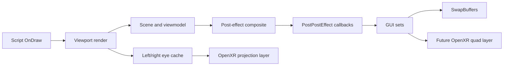

# Future Systems Reverse Engineering

## 0.24.0 Room-Scale Safety Result

The shipped global script surface registers:

```text
bool CheckLineOfSight(const cVector3f&in avStart,
                      const cVector3f&in avEnd,
                      bool abCheckOnlyShadowCasters,
                      bool abCheckOnlyStatic,
                      iLuxEntity@ apSkipEntity=null)
```

The compact wrapper at `0x1400cd710` has a directly callable four-argument x64
ABI and supplies the null skip entity itself. It forwards to the recovered world
query at `0x140143650`, which resolves the active world and calls the physics-ray
callback at vtable `+0x148`. A clear segment returns true; missing world state or
an obstruction returns false.

`0.24.0` uses this boundary without a detour. It queries from the native camera
origin to the calibrated physical-head translation with `shadowOnly=false` and
`staticOnly=true`. A blocked segment is bisected for a bounded number of
iterations, then retracted by the configured clearance. The safe physical-head
component replaces only the raw physical-head component in eye/controller poses,
so IPD, eye-height calibration, authored camera movement, and relative hand aim
remain coherent.

The current query models the head as a point and intentionally ignores dynamic
objects. Next stages are: validate world-unit clearance across maps, identify a
dynamic-inclusive policy that does not jitter against moving doors, and replace
the point segment with multiple rays or a confirmed shape/capsule sweep. Native
player capsule movement remains entirely owned by SOMA.

## 0.23.0 Controller Flashlight Result

Shipped `script/player/Player.hps` creates one `cLightSpot` named exactly
`Flashlight`. `UpdateFlashlightRotation()` builds
`camera rotation * rotateXYZ(5 degrees pitch)`, applies the authored
`(0.03,-0.03,0)` camera-local offset, and ends at
`cLux_ID_Light(mFlashlight_Light).SetMatrix(mtxLightRotate)`. This converges on
the same registered `iLuxEntity.SetMatrix` wrapper at `0x1400bcd90` and inherited
name accessor at `0x14000fb60` already guarded by `HPLHandsBridge`.

`0.23.0` adds an exact `name == "Flashlight"` branch at that shared boundary and
rebuilds only the submitted matrix from the dominant OpenXR **aim** pose. The
spotlight's local negative Z follows tracked aim-forward; position and rotation
calibration are independent from the grip-driven hand root. Missing player
state, authored-camera suppression, inactive/stale tracking, or invalid basis
always forwards the native matrix. The light object itself is untouched, so
fade/color/visibility, radius/FOV/near clip, environment-particle registration,
frustum collision, light sensors, and callbacks retain native ownership.

One semantic mismatch remains explicit. `UpdateFlashLightLOS()` uses the moved
light's frustum and world position for general sensor tests, but its randomized
agent-gobo sample still constructs rays from `cCamera::GetPitch/GetYaw` and the
camera position. A future callsite-specific bridge or script override should
align those three low-frequency rays to controller aim after live visual
acceptance; broad camera getter hooks are not justified.

## 0.22.0 Physical Manipulation And ImGui Identity Result

Shipped `Player_Types.hps` fixes the physical state IDs as Wheel `3`, Slide `4`,
SwingDoor `5`, Lever `6`, and Tear `7`. Their state implementations inherit
`PlayerState_Interact_RotateBase.hps::OnAnalogInput`: analog Look accumulates a
2D `mvMoveAdd` after the native invert-Y policy, and each derived state projects
that accumulator through its own joint direction, hinge, PID, constraints, and
script callbacks. This is a high-confidence controller boundary without a new
native hook.

`0.22.0` measures dominant grip position relative to HMD position, projects the
frame displacement onto current HMD right/up, and sends bounded relative mouse
motion only in states `3..7`. Common room-scale translation therefore cancels.
The first sample, state changes, tracking loss, pause/authored-camera suppression,
and VR teardown reset the anchor and subpixel accumulator. Grab `1` and Push `2`
remain on their existing dedicated physics/throw routes. Live acceptance now
needs examples of every state plus per-axis sign/sensitivity tuning.

The screen-space path also gained a passive identity probe. Ghidra confirms
`GetCurrentImGui` `0x1400cca70` (`gameContext +0xe8 -> +0x168`),
`GetGameHudImGui` `0x1400cca90` (`+0xe8 -> +0x160`), and the registered
`cImGui::GetSet` wrapper `0x140071f20` (`return this+0x18`). The existing
`cGuiSet::Render` hook now logs exact current/game-HUD ImGui-set matches without
capturing or suppressing them. The next broad live pass should exercise
inventory, hints, pause/load/death/wake/credits/video and retain those rows;
presentation changes wait for identity evidence.

## 0.21.0 Semantic Reticle And Native Artwork Result

The shipped script layer closes the main interaction-feedback ambiguity left by
`0.20.0`. `PlayerState_Normal` performs native pick validation, asks the active
entity for its icon ID, and routes the result through global callback
`LuxPlayer::_Global_SetCrosshairState`. Confirmed wrappers at `0x140484ea0` and
`0x1404851d0` now provide a signature-guarded observer without replacing script
policy. The VR reticle consumes exact enum state plus the existing native hit
depth and dominant aim pose.

All 34 assets named in shipped `Player.hps` are unpacked under `graphics/hud`.
`0.21.0` decodes and aspect-fits those uncompressed TGAs directly into the
application-space OpenXR quad, with intent color and focus-haptic profiles plus
the old procedural cross as fallback. Remaining work is empirical: verify every
state, determine whether the ambiguous default cursor should remain depth-locked,
and add an occlusion rule only if the compositor quad visibly leaks through
foreground geometry.

## 0.20.0 Depth Reticle And Focus Feedback Result

The native closest-entity aim pose and finalized distance now feed a dedicated
application-space OpenXR alpha quad. Angular-size and physical-size clamps keep
its apparent size stable, while frame-age, tracking, distance, stereo-layer, and
resource guards clear or omit it on every unsafe path. Native entity/body
identity transitions can also request a low-amplitude cooldown-limited haptic.

This closes the generic world-depth presentation boundary. Remaining reticle
work is narrower: locate SOMA's crosshair icon/availability owner, decide how
semantic states vary or suppress the marker, and determine whether world-geometry
occlusion warrants an engine-rendered alternative to the compositor quad.

## 0.19.0 Semantic Comfort And Focus Result

The shipped player enum and registered `SetCameraPosAdd` wrapper now provide a
narrow comfort boundary: `HPLComfortBridge` can zero Bob `1`, Shake `2`, and Sway
`9` only while VR tracking is active, preserving every authored state channel.
This replaces the previous broad "map bob/shake ownership" task with a live
acceptance task. See `COMFORT_AND_FOCUS_RE.md` for the ABI and enum ledger.

The native closest-entity output is also decoded after SOMA finalizes it. Entity
`+0x18`, body `+0x20`, and distance `+0x28` feed an immutable frame/hand/world-hit
snapshot. A world-depth reticle no longer needs to reconstruct depth from GL;
`0.20.0` proves the compositor-layer boundary, leaving semantic icon ownership
and optional world occlusion as the remaining policy.

## 0.18.0 Grab Rotation, Throw, And Reticle Policy

The shipped Grab state's torque PID (`40/0/0.4`, underwater `D=0.1`) now has a
guarded controller target. `HPLGrabMath` resolves the shortest quaternion arc
from the pickup grip orientation, applies SOMA's authored `angle * 100` gain and
`6` speed cap, transforms that reference-space vector into HPL world space, and
adds it to the native torque error. SOMA still subtracts body angular velocity,
applies the PID, transforms through inertia, and caps torque at `1000`.

The registered AddImpulse script wrapper is the nine-byte thunk at
`0x14049c720`: `mov rax,[rcx]; jmp [rax+0x130]`. A normal MinHook trampoline is
not reliable at that size, so `0.18.0` guards the thunk plus three INT3 bytes and
uses a reversible absolute jump. Only a one-shot intent armed immediately before
the native Grab right-click may redirect the impulse; all other calls dispatch
straight to the concrete body virtual method. The native impulse magnitude,
including SOMA's object-mass multiplier, remains the baseline.

The fixed center crosshair is optionally removed after exact GameHudSet capture
by clearing a small center rectangle to transparent. `0.20.0` replaces its depth
role with a controller-aimed OpenXR quad driven by decoded native pick distance;
crosshair semantic icons still need ownership mapping.

## 0.17.0 Physics Input And Native Grab Findings

SOMA's shipped `PlayerState_Interact_Grab.hps` configures its position PID as
`P=400, I=0, D=40`, computes `wantedPosition - bodyPosition`, and sends that
vector through native output `0x140238750`. Rotation uses the same vector PID
implementation with `P=40, I=0, D=0.4` (`0.1` underwater). These exact gain
tuples provide a stronger runtime identity gate than a broad camera getter.

`HPLGrabBridge` therefore changes only the force-PID error in player state Grab
`1`. It anchors dominant grip relative to the current native camera on the first
sample, leaves that pickup call untouched, and adds subsequent camera-relative
controller displacement with a configurable world-scale cap. The native solver,
force clamps, object mass, gravity, collision, constraints, and script lifecycle
remain authoritative. Invalid/stale tracking, authored cameras, state changes,
signature mismatch, or a different PID tuple preserve the original error.

OpenXR grip spaces now return predicted-time linear and angular velocity. The
torque tuple is observed without mutation, and release logs include both vectors.
The next safe step is to correlate controller quaternion delta against native
rotation-error axes in a live capture before replacing rotational error. Throw
impulse substitution likewise waits for native impulse scale and direction
evidence; this build invokes SOMA's existing Right Mouse throw/cancel action.

Movement can now be head-relative by applying calibrated HMD yaw only. Physical
crouch uses raw tracked head height, a recenter generation, and hysteresis while
leaving SOMA's crouch state and capsule transition on the native action path.

## 0.16.0 Controller Hands And Paused Menu Findings

The shipped `PlayerHandsHandler.hps` closes the default transform equation:

```text
scale = fullScale ? 1.0 : 0.25
root = cameraRotation * rotateY(pi) * scale
position = cameraPosition + (0, -0.3, 0) * scale + reduced head bob
```

HPL's `cMath::MatrixUnitVectors` confirms that right/up/forward are matrix
columns and translation occupies `[3,7,11]`. `HPLHandsMath` therefore builds a
proper HPL basis from tracked grip forward/up, applies the same two-axis sign
flip represented by `rotateY(pi)`, preserves the incoming uniform quarter scale,
and applies configurable controller-local position plus model-space XYZ rotation
calibration. This also corrects the older probe's row-labelled basis telemetry.

`HPLHandsBridge` substitutes that matrix only for exact `PlayerHands_*` identity,
Normal player state `0`, Normal move state `0`, non-authored camera ownership,
uniform quarter scale, and a fresh fully tracked dominant grip. Full-scale hand
animations, ladders/crawl/special states, custom/authored matrices, tracking
loss, stale input, malformed bases, and signature failure remain byte-for-byte
native. The mesh, skeleton, animation state, `R_Hand` socket, attached tool, and
script callbacks are never replaced.

The confirmed `cLux_GetGamePaused` wrapper now serves the whole controller input
policy instead of only direct body calls. A true pause releases movement, turn,
sprint, and gameplay interaction before any semantic W/A/S/D or mouse fallback
can run. `HPLMenuMath` projects dominant aim relative to the HMD onto a
configurable virtual menu FOV; `HPLMenuBridge` maps the result into SOMA's native
client rectangle. Trigger/select remains a native left click, and a release
latch prevents the closing click from becoming an immediate world interaction.

Live acceptance must tune root calibration against the visible hand/tool, verify
native fallback across authored/full-scale states, and confirm cursor behavior in
windowed, borderless, and exclusive-fullscreen modes. Per-tool root profiles and
non-pausing ImGui surfaces remain future classification work.

## 0.14.0 Native Locomotion And Turn Findings

The registered body wrappers now form a useful split ownership path rather than
an all-or-nothing replacement for SOMA's input system. `iCharacterBody::Move` at
`0x1402375f0` accepts Forward `0` and Right `1` analog accumulators;
`iCharacterBody::AddYaw` at `0x140237460` accepts radians. The registered
`cLux_GetGamePaused` wrapper at `0x1400ccc90` provides the missing menu/pause
gate.

`HPLNativeLocomotion` calls these native body functions only when all signatures
match, the pause getter returns false, the current player/body is valid, and
both player state and move state are Normal (`0`). In that narrow state the
controller receives radial-deadzone analog movement and exact-angle body yaw.
Every ladder, grab, push, terminal, read, sit, conversation, authored-camera,
climb/dead move state, pause, invalid pointer, and signature failure returns to
the existing W/A/S/D and mouse path so SOMA's script handlers remain authoritative.

This closes the normal-locomotion fidelity gap without pretending the direct
body wrapper is a universal semantic dispatcher. Live acceptance now needs
speed magnitude, run/crouch/collision/audio behavior, exact turn direction,
pause safety, and transitions into and out of special states.

## 0.13.0 Hands Identity And Root-Pose Findings

SOMA's `cLuxProp` registration owner at `0x14016ebe0` connects the hand script to
two exact native boundaries. `SOMA_iLuxEntity_GetName` (`0x14000fb60`) returns
the native `tString` at entity `+0x120`; `SOMA_iLuxEntity_SetMatrix`
(`0x1400bcd90`) receives the script's `const cMatrixf&` in `RDX` before forwarding
it to the entity virtual method. This proves a selective probe can identify the
runtime hand by its authored `PlayerHands_*` prefix without resource-pointer or
camera-distance heuristics.

`HPLHandsBridge` signature-guards both functions, caches bounded entity identity,
and passively samples only exact hands matrices. It records translation, three
basis lengths, quarter/full/other scale mode, basis rows, distance from the
native camera root, dominant tracked grip position/forward and root distance,
plus authored-camera and player/move-state ownership. Every input matrix is
forwarded unchanged.

The remaining information is concrete rather than open-ended:

1. Confirm the normal hand model reports quarter scale and a stable root offset.
2. Measure the model's basis against controller grip forward/up to derive the
   fixed model-space orientation correction.
3. Exercise tool draw/idle/holster, crawl/ladder, full-scale animations, custom
   position/rotation, and camera-socket attachment to classify override-safe states.
4. Use the measured correction only in normal quarter-scale states; preserve or
   blend authored/full-scale matrices and immediately fall back on tracking loss.

This dataset is sufficient to build a configurable controller root transform in
the next pass without replacing the mesh, skeletal animation, `R_Hand` sockets,
attached tools, or script callbacks.

## 0.12.0 Native Interaction And Transform Findings

The registered `GetClosestEntity` wrapper at `0x1400cd750` is the exact native
boundary used by `Utility_PickBasics.UpdatePickCheck`. The new interaction bridge
substitutes only its start/direction arguments under strict world-pose, query-type,
camera-origin, and authored-camera gates. SOMA still owns selection distance,
LOS, `CanInteract`, focus state, player-state entry, and callbacks.

All inspected AngelScript registrations for `iLuxEntity.SetMatrix` and derived
Lux entity types converge on shared wrapper `0x1400bcd90`. The hands script
creates `PlayerHands_*` from `character/player/hands/hands_human.ent` and calls
`pEntity.SetMatrix(mtxHands)` each active `PostUpdate`; tool meshes remain attached
to `R_Hand`. This identifies the transform mutation boundary but not yet the
runtime entity identity. `0.13.0` closes that identity gap with the confirmed
name accessor and bounded root-pose probe; model-space correction and state
classification remain live acceptance gates before matrix replacement.

The exact gameplay HUD hook now also logs confirmed context metrics at
`+0x58/+0x60/+0x70/+0x7c/+0x84`. These virtual center, full virtual-space, and
center-screen values are the calibration inputs for a resolution-independent
alpha target and future OpenXR quad layer.

## 0.11.0 Spatial Ownership Findings

The proven stereo origin and base-view basis now form a reusable HPL world-pose
boundary. The bridge converts the dominant controller's OpenXR aim and grip
poses into world positions plus normalized forward/up vectors. Runtime telemetry
is intentionally passive: it validates coordinate handedness, scale, and pose
stability before the ray is allowed to influence native interaction selection.

This closes two prerequisites. `FEATURE.INTERACTION_RAY` now has a concrete
world query pose, while `FEATURE.VIEWMODEL` has a concrete controller grip
anchor. The remaining work is ownership RE: native closest-entity/focus state
for interaction, and the default camera-follow transform owner for hands/tools.

The exact gameplay HUD set is also identifiable through confirmed
`SOMA_GetGameHudSet` at `0x1400cc9b0`. Flat HUD capture can therefore target one
known `cGuiSet` instead of guessing from dimensions or suppressing all GUI.

## 0.10.0 Tracking And Controller Role Findings

OpenXR view validity is now treated as a temporal contract rather than a single
boolean. A failed or partially valid `xrLocateViews` sample never enters the
persistent eye cache. The camera may consume the previous sample only within
`TrackingHoldFrames`; during that grace period the sample is explicitly marked
untracked, and after it expires the HPL bridge restores the native base view for
the frame without deleting stereo intent. Recovery adds a short zero-layer
blackout before normal stereo presentation resumes. Live coverage still needs a
repeatable way to obstruct or disable HMD tracking for both short and extended
intervals.

Controller ownership is now explicit and configurable. Dominant hand controls
interaction and face actions; `SwapSticks` changes locomotion/turn stick roles.
When exactly one controller remains active, it becomes the dominant movement
hand and turn/sprint are suppressed to avoid overloading a single stick and
trigger. Touch and Index have bilateral primary/secondary bindings. Simple and
Microsoft Motion profiles still need confirmed face-button paths before their
one-controller action coverage can match Touch/Index.

## 0.9.0 Calibration, Haptics, And Authored Roll Findings

OpenXR application-space ownership is now explicit. `LOCAL` remains the default
because F10 neutral-pose calibration has already been proven there. `STAGE` is a
configurable floor-aware profile and falls back to LOCAL if the runtime does not
advertise it. The live acceptance gate is eye height and recenter behavior across
standing, seated, save/load, and map transitions; no camera-scale change is needed.

Controller haptics now have a proper OpenXR vibration-output action and profile
bindings. The first policy is intentionally semantic and discrete: confirmation
for actions already accepted by SOMAVR's native input bridge. Damage, weapon,
contact, and object-material haptics still need native gameplay event anchors.

Ghidra confirms `cCamera` base roll at `+0x4c` and extended/authored roll at
`+0x68`. `SetRoll` invalidates `+0x709/+0x70b/+0x70c/+0x70d`; extended roll
invalidates the secondary frustum at `+0x70d`. `HPLCameraBridge` can therefore
temporarily zero both roll channels only around native frustum evaluation,
restore them immediately, and mark the same caches dirty. This is built but
disabled by default. A live sit/impact/scripted-camera comparison is required
before making it part of the standard comfort policy. Remaining bob/shake work
needs attribution of native position/pitch/yaw offsets, not another shader probe.

Created: 2026-07-11. Status: static research and implementation planning. No runtime behavior or build output changed by this pass.

## Scope

This document maps the next gameplay-facing VR systems:

- locomotion and body/head yaw ownership;
- player hands, held tools, and the future weapon/viewmodel path;
- HUD, menus, subtitles, and diegetic GUI;
- post-processing, screen overlays, camera shake, and other full-screen effects.

Evidence comes from SOMA's shipped AngelScript files, `Soma_NoSteam.exe` in Ghidra, and the released HPL2 source. HPL2 is used to explain matching engine behavior, not as proof that every HPL3 offset is identical.

## Render And Script Order

The executable's main loop at `0x1402332b0` gives us the useful high-level boundary:

1. Dispatch script `OnDraw` through `0x1402328f0` with callback id `2`.
2. Render all active viewports through `0x140298850`.
3. Dispatch script `OnPostRender` through `0x1402328f0` with callback id `3`.
4. Present the frame.

Inside each viewport, `0x140298630` performs this order:

1. Obtain the camera frustum through `0x140271b80`.
2. Render the scene through `0x1401f9790`.
3. Run viewport callbacks through `0x140297670`.
4. If effects are active, run the priority-sorted post chain through `0x14033bd80`.
5. Run the `PostPostEffect` renderer callback pass through `0x1401f1480`.
6. Draw queued GUI sets through `0x1402981e0`.

This is the central design fact for future work: stereo scene rendering and scene post effects belong inside the per-eye viewport path; flat HUD extraction belongs after post effects and before final presentation.



## Locomotion

### Confirmed Ownership

SOMA creates separate analog actions for forward, backward, left, and right in `script\base\InputHandler.hps`. They are grouped as `eAnalogType_Move`; the controller stick is `eAnalogType_GamepadMove`, and look is `eAnalogType_Look`.

The native `iCharacterBody` API is registered at `0x1404a5030`. That registration maps the script-visible `Move(eCharDir, float)` call to `0x1402375f0` and exposes `SetMoveSpeed`, `AddYaw`, and `SetYaw`. The released HPL2 implementation confirms the important semantics:

- `Move` accumulates a directional input multiplier for the current physics update.
- `SetMoveSpeed` changes the speed state; it is not the normal input entry point.
- character yaw owns the horizontal forward/right basis used by movement;
- camera pitch is independent;
- the character body can be linked to the camera, but scripted states can detach or override that link.

SOMA's normal movement state applies speed, acceleration, running, crouching, crawling, underwater, conversation, heavy-tool, and script multipliers before the native character controller resolves motion. It also owns jump state and head bob.

### Camera Layers To Separate

| Layer | Current owner | VR treatment |
| --- | --- | --- |
| Body yaw | `iCharacterBody` | Snap/smooth turn writes body yaw. Never derive continuous body yaw directly from HMD yaw. |
| Camera pitch/yaw look | camera/body input path | HMD orientation remains the late native-camera delta already proven by F10. |
| Room-scale translation | HMD pose | Apply to the rendered camera; use a collision-aware recenter policy before moving the body capsule. |
| Crouch | move state and character-body size | Keep button crouch initially. Physical crouch can later select the same state after calibrated height thresholds. |
| Bob, sway, shake, lean, crawl | additive camera offsets/roll | Disable or attenuate by comfort policy; do not bake them into HMD tracking. |
| Ladder, sit, climb, scripted camera | player state overrides | Use explicit state adapters. These states modify yaw limits, camera mode, camera attachment, or auto-movement. |

### Recommended Input Route

The final controller path should inject at SOMA's semantic action layer or the
state-aware `cLuxPlayer` movement/look wrappers. Direct capsule mutation remains
out of bounds because it bypasses gameplay state.

`0.7.0-controller-prototype` deliberately added an earlier tactical stage: it
feeds OpenXR controls through SOMA's existing keyboard/mouse input path. This
immediately preserves normal menu and player-state routing while a bounded
native probe records player pointer, camera/body ownership, player state, and
move state. It is reversible, configuration-gated, and releases all held inputs
when the OpenXR sample becomes stale. It is not the final analog locomotion path.

For each update:

```text
stick = deadzone_and_curve(openxr_left_stick)
heading = body_yaw                     // controller-relative mode
heading = body_yaw + hmd_local_yaw     // optional head-relative mode
move_forward = rotate_y(stick.y, heading)
move_right   = rotate_y(stick.x, heading)
submit Move(Forward, move_forward)
submit Move(Right, move_right)
```

Body turn should be a separate action:

- snap turn: add a fixed yaw step and apply a short optional vignette;
- smooth turn: integrate stick X into body yaw with a configurable rate;
- after either turn, preserve the current HMD-local orientation so the rendered view does not jump twice.

### Implementation Stages

1. **Passive probe:** built in `0.7.0`; logs current player state, move state, character-body pointer, camera pointer, and active-camera ownership.
2. **Input-path prototype:** built in `0.7.0` and expanded in `0.7.1`; maps move, turn, interact, menu, recenter, run, crouch, and jump with stale-input release and config gates.
3. **Native action bridge:** built for unpaused Normal/Normal ownership in
   `0.14.0`; uses analog body Move and exact-radian AddYaw, with automatic
   semantic key/mouse fallback for every other state. A higher semantic analog
   dispatcher is still preferable for special-state analog fidelity.
4. **State adapters:** first ownership adapter built in `0.7.2`; matrix camera mode or disabled body camera updates suppress injected gameplay input while preserving menu/recenter. Normal, ladder, sit, climb ledge, crawl, interaction, conversation, and death still need live classification.
5. **Physical movement:** optional physical crouch and collision-aware room-scale body catch-up.

### Locomotion Risks

- Ladder and climb scripts actively steer body yaw and camera pitch.
- Sit and hand-animation camera attachments switch the camera to matrix rotation and can disable character-body camera updates.
- Lean performs a head-shape collision test; replacing it with unrestricted HMD translation would allow clipping.
- Head bob, sway, and shake are separate additive systems and must not be mistaken for body movement.
- Movement speed affects breathing, sound radius, AI reactions, and animation state. Moving the capsule directly would bypass gameplay.

## Hands, Tools, And Viewmodels

### Confirmed SOMA Path

SOMA's closest equivalent to a weapon viewmodel is `script\modules\PlayerHandsHandler.hps` plus `PlayerToolHandler.hps`.

The hands path is a real world entity, not a 2D overlay:

- model: `character/player/hands/hands_human.ent`;
- default scale: `0.25` unless a full-scale animation is requested;
- default transform: camera rotation plus `gvHandsOffset`, camera position, and a reduced head-bob term;
- attached props: socketed to `R_Hand`;
- render flags: no shadow casting and no reflection visibility;
- tool states: draw, idle, holster, and custom animation;
- tool entities are called `HudObject` in scripts but are world mesh entities attached to the hand.

The hands can also drive the camera. `AttachCameraToSocket` disables character-body camera updates, switches the camera to matrix mode, and blends the camera to an animation bone. This is used for authored sequences and must remain a special case.

### VR Design

Preserve the existing mesh, materials, animations, attached Omnitool/tool entities, and gameplay callbacks. Replace only the default camera-follow transform with a controller-owned transform when the hands are in a VR-compatible state.

Recommended ownership:

| State | Transform owner | Notes |
| --- | --- | --- |
| Tool idle/draw/holster | dominant controller | Keep authored hand animation local to the controller anchor. |
| Generic interaction animation | controller plus authored local animation | Blend into the interaction target rather than snapping the camera. |
| Full-scale hands animation | authored world transform | Treat as a temporary sequence; HMD view remains independent where possible. |
| Camera-attached animation | compatibility adapter | Do not let the animation overwrite raw HMD orientation. Use its body/world motion as a base pose. |
| Carried physics object | one/two controller target | Keep native physics and interaction callbacks authoritative. |

### Projection And Depth

Because the current hands are scaled and placed at the camera, simply enabling stereo may make them feel miniature or converge at an uncomfortable distance. The implementation should expose:

- controller-to-hand position and rotation offsets;
- hand world scale;
- a viewmodel near clip separate from the world near clip if clipping becomes visible;
- optional depth bias only as a fallback;
- dominant-hand selection;
- per-tool pose profiles.

The preferred long-term path is full-scale geometry at a physically plausible controller pose, rendered in the normal per-eye scene. A separate viewmodel projection is acceptable only if existing assets cannot be made physically stable.

### Implementation Stages

1. **Classification probe:** camera-attachment ownership is now detected natively in `0.7.2` through camera `+0x6c` and body `+0x1e8`. Hands entity, attached tool, active animation, full-scale, and custom-transform fields remain.
2. **Stereo preservation:** verify the existing camera-follow hands render once per eye with correct IPD and depth.
3. **Controller pose:** built in `0.16.0`; only exact normal quarter-scale
   `PostUpdate` roots are replaced, retaining animation/socket/tool updates and
   falling back immediately for authored/full-scale/tracking-loss states.
4. **Interaction ray:** source focus/pick checks from the dominant controller while leaving native interaction callbacks intact.
5. **Two-hand and physics interaction:** add support for doors, wheels, levers, grabbed bodies, Omnitool insertion, ladders, and carried objects.

## HUD And GUI

### 0.15.0 Gameplay HUD Layer Findings

Ghidra confirms `HPL3_GuiSet_Render` at `0x140213970` ignores its native
render-target argument for 2D sets and draws into the current OpenGL framebuffer.
This is the narrow capture boundary now owned by `HPLHudBridge`:

```text
exact GameHudSet -> transparent GL capture FBO -> HUD OpenXR swapchain
                 -> alpha XrCompositionLayerQuad in VIEW space
```

The bridge clears to transparent, renders only the exact set, restores the
incoming framebuffer/viewport/buffer state, and keeps all nonmatching sets on
the original path. Capture begins only while the OpenXR session is VISIBLE or
FOCUSED and all resources are valid. Resource/signature failures never suppress
the native HUD; repeated copy failures suspend extraction and restore it.

This is deliberately gameplay-HUD-only. ImGui inventory/hints, pause/load/death
menus, subtitles not owned by GameHudSet, and diegetic GUI still need live
classification before they can share or receive separate layers.

### Surface Classes

SOMA does not have one monolithic HUD.

| Surface | Examples | Current path | VR destination |
| --- | --- | --- | --- |
| Gameplay HUD | crosshair, descriptions, infection border, white flashes | `cLux_GetGameHudSet()` queued in `OnDraw` | Extract to a transparent texture; submit as a configurable OpenXR quad/curved layer. |
| ImGui HUD | hints, inventory, menus, wake/game-over, credits | `cLux_GetGameHudImGui()` / module `OnGui` | Same HUD texture/layer initially; separate menu layer later if useful. |
| Diegetic GUI | terminals, handheld terminals, screens | world `cGuiSetEntity`/terminal callbacks | Keep in the stereo world and drive with a controller ray. |
| Interaction reticle | native picker result now; crosshair state enum still pending | application-space OpenXR quad at hit depth | Keep generic marker bounded; map icon/availability semantics and assess world occlusion. |
| Subtitle/dialog text | engine/game GUI path | flat screen-space text | Head-locked quad with adjustable distance, height, scale, and safe width. |

The crosshair is centered using `cLux_GetHudVirtualCenterSize()` and can be shifted by the eye-tracking extended-view offset. That eye-tracking concept is useful precedent: reticle position is already treated separately from camera orientation.

### Capture Strategy

Do not begin by hooking every `DrawGfx` call. The implemented route identifies
the exact gameplay set during final GUI iteration at `0x1402981e0`, redirects
its 2D draw at `0x140213970` to a transparent HUD framebuffer, then restores
the world eye target before the next set and presentation.

The HUD texture can be submitted as an `XrCompositionLayerQuad`:

- default head-locked distance around 1.5 to 2.0 meters;
- configurable angular size and vertical offset;
- alpha-preserving format;
- no reprojection of the HUD through the scene camera;
- optional curved geometry later if a flat quad is uncomfortable at wide sizes.

Menus should pause or suppress locomotion and use the controller ray as a mouse pointer. Controller buttons should still enter SOMA's existing menu actions so navigation logic remains native.

### Crosshair Strategy

The fixed screen-center crosshair should be hidden once controller interaction is active. Its semantic state remains valuable because it reports `PickUp`, `UseTool`, `Terminal`, `ClimbLadder`, and other interaction types.

Use that state to select feedback at the controller ray hit:

- a small world-space reticle at hit depth;
- controller highlight/haptics;
- optional compact icon on the HUD layer for accessibility.

### Implementation Stages

1. **GUI target probe:** built in `0.7.2` and moved into `HPLHudBridge` in `0.15.0`; exact matches preserve virtual metrics, GL state, and draw deltas.
2. **HUD-only framebuffer:** built in `0.15.0`; exact GameHudSet draws into a transparent target while the per-eye scene and nonmatching sets remain untouched.
3. **OpenXR quad layer:** gameplay HUD submission in VIEW space is built in `0.15.0`; ImGui/menu/subtitle classification remains.
4. **Controller pointer:** paused native-window pointer and click routing are
   built in `0.16.0`; direct virtual-GUI coordinates and non-pausing ImGui
   surfaces still need identity/presentation classification.
5. **Reticle split:** suppress the native centered crosshair and render interaction feedback at world depth.

## Full-Screen Effects

### Effect Inventory

`config\Effects.cfg` defines the game effect modules. Script-created post effects are inserted into the native priority-sorted `cPostEffectComposite`.

| Effect | Priority/path | VR policy |
| --- | --- | --- |
| Tone mapping, bloom, film grain | viewport tone-mapping effect; native default post priority includes `-100` | Run per eye. Bloom and grading should survive; film grain may need reduction at headset resolution. |
| Image trail | `-100000` | Disable by default in VR. It owns temporal history textures and is very likely to amplify AFR and head-motion mismatch. |
| Chromatic aberration | `25` | Disable by default. The HMD runtime already owns optical distortion; artistic RGB separation can be offered as an opt-in reduced effect. |
| Radial blur | `50` | Disable or strongly reduce. Screen-center blur is uncomfortable and conflicts with gaze/controller focus. |
| Lens distortion | `75` | Disable. It must not pre-distort imagery before OpenXR runtime distortion. |
| ImageFadeFX | `100` | Run per eye for authored transitions, or translate simple fades to an OpenXR quad layer. |
| Video distortion | `100` | Run per eye with reduced intensity; validate both eyes use independent current-eye input. |
| Depth of field | world/viewport depth effect | Disable by default, especially during free head movement. If retained, it requires correct per-eye depth and a stable focus policy. |
| Color grading/fog | world and map effect state | Keep per eye. These are scene effects rather than screen motion effects. |
| Flash/energy flash | full-screen `GameHudSet` draw | Move with HUD capture or a dedicated fade/flash quad layer. |
| Infection border | `GameHudSet` edge graphics | Keep on HUD layer; avoid filling peripheral vision at full intensity. |
| Screen material effect | point billboard about `0.15` m in front of camera | Replace or push outward. At 15 cm it will have extreme convergence in stereo. |
| Shake | additive camera position | Reduce or disable by comfort setting; never add it to raw HMD pose. |
| Sway | camera position plus roll | Disable roll and heavily reduce translation by default. |
| Head bob/crawl/lean | player camera adds | Comfort controls; preserve gameplay state without forcing the full camera motion. |

### Native Anchors

- `0x14033c240`: inserts a post effect into the priority-sorted container and retains it in the effect list.
- `0x14033b8f0`: reports whether any post effect is active.
- `0x14033bd80`: iterates active effects in priority order and ping-pongs the render target.
- `0x14038ae60`: creates the `ImageTrailTexture` and `ImageTrailBuffer` history resources.
- `0x1403896e0`: initializes the chromatic-aberration shader and uniforms.
- `0x14038a5d0`: initializes the radial-blur shader and uniforms.
- `0x1403870a0`: initializes the image-fade shader and uniforms.

### Stereo Requirements

Each eye needs its own scene color, depth, temporal camera packet, and temporal history. Sharing temporal history between eyes will create cross-eye contamination. AFR is especially sensitive because each eye is one game frame older than the other.

The immediate policy for the AFR test line should therefore be:

- disable image trail;
- disable lens distortion;
- disable chromatic aberration and radial blur by default;
- disable or reduce depth of field;
- reduce shake, sway, roll, and head bob;
- retain tone mapping, bloom, fog, and color grading;
- retain fades/flash only after confirming they are captured identically for both eyes.

Same-frame dual rendering can later restore more effects, but temporal effects still require independent per-eye history.

### Implementation Stages

1. **Effect activity probe:** built through `0.8.0`; logs named vtable identity, priority-tree result, active flags, input texture, render target, stage GL flow, and transitions. `Ctrl+F12` isolates one active effect per render call and `Shift+F12` restores policy. Texture dimensions remain to be mapped.
2. **VR comfort policy:** first named policy built in `0.8.0`. It temporarily suppresses ImageTrail, ChromaticAberration, and RadialBlur during active stereo rendering and restores their native active bytes immediately after the compositor call.
3. **Per-eye post chain:** ensure the scene and post composite execute inside each eye render before caching/submission.
4. **Per-eye history:** duplicate image-trail/temporal resources only if those effects are intentionally restored.
5. **Overlay extraction:** move simple flashes, fades, and infection/HUD overlays to alpha-capable OpenXR layers.

## Probe Order

### Native Movement Boundary Result

`HPL3_Script_iCharacterBody_Move` at `0x1402375f0` and
`HPL3_Script_iCharacterBody_AddYaw` at `0x140237460` are now wired only for the
unpaused Normal player plus Normal move state. This is the one state where the
base player script ultimately forwards analog movement to those same body
accumulators. All special states continue through reversible W/A/S/D and mouse
input because their script handlers may reinterpret move/look as ladder motion,
object manipulation, menu control, or authored-camera steering. The split route
gains analog ordinary locomotion without bypassing known special-state policy.

These probes are ordered to minimize runtime risk and maximize reusable information:

1. Player/body/action telemetry with no input mutation. **Built.**
2. Active player/move state and camera-mode telemetry. **Built; first authored ownership policy added in `0.7.2`.**
3. Hands/tool entity classification and matrix telemetry.
4. Post-effect active list, priorities, framebuffer flow, and eye attribution. **Named identity, priority lookup, isolation, temporary comfort policy, and GL flow are built; texture dimensions and per-eye history ownership remain.**
5. GUI-set final target and alpha behavior. **GL state/flow probe built; transparent-target redirection remains.**
6. OpenXR controller action set and semantic input bridge. **Built; `0.14.0`
   adds a guarded native normal-state fast path with semantic fallback.**
7. HUD quad-layer extraction.
8. Controller-driven hands and interaction ray.

## Graphify Seed

Add these groups to the existing graph when Graphify is introduced:

- Input: `OpenXR actions -> SOMA action bridge -> player state -> move state -> iCharacterBody`.
- Pose ownership: `body yaw + authored camera base + HMD local pose -> cCamera::GetFrustum`.
- Viewmodel: `PlayerHandsHandler -> hands entity -> R_Hand socket -> tool/HudObject`.
- Render: `scene -> post composite -> PostPostEffect -> GUI sets -> eye cache`.
- HUD: `GameHudSet + cImGui -> HUD framebuffer -> XrCompositionLayerQuad`.
- Interaction: `controller ray -> native pick check -> crosshair semantic state -> native callback`.

Useful edge labels: `owns`, `adds_to`, `dispatches`, `renders_before`, `renders_after`, `attaches_to`, `feeds`, `suppresses_in_vr`, and `submits_as_layer`.

## Open Questions For Runtime Tests

- Does the current AFR cache include the GUI pass, or is it captured before `0x1402981e0`?
- Does SOMA allocate one temporal history packet per viewport or globally?
- Can the default hands entity be identified reliably by model/resource pointer without script modification?
- Which native/script VM boundary can receive `eAnalogType_Move` for all player
  states without constructing AngelScript objects manually? This is now an
  optional special-state fidelity improvement, not a blocker for normal analog movement.
- Are subtitles drawn by the game HUD set, ImGui, or a separate engine GUI set in gameplay?
- Do terminal GUI entities render before or after the scene post chain?
- Which authored sequences require camera-to-hand socket attachment, and can their world motion be separated from their camera rotation?
