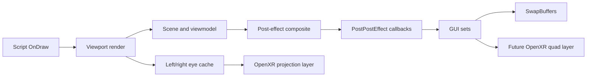

# Future Systems Reverse Engineering

Created: 2026-07-11. Status: static research and implementation planning. No runtime behavior or build output changed by this pass.

## Scope

This document maps the next gameplay-facing VR systems:

- locomotion and body/head yaw ownership;
- player hands, held tools, and the future weapon/viewmodel path;
- HUD, menus, subtitles, and diegetic GUI;
- post-processing, screen overlays, camera shake, and other full-screen effects.

Evidence comes from SOMA's shipped AngelScript files, `Soma_NoSteam.exe` in Ghidra, and the released HPL2 source. HPL2 is used to explain matching engine behavior, not as proof that every HPL3 offset is identical.

## Render And Script Order

The executable's main loop at `0x1402332b0` gives us the useful high-level boundary:

1. Dispatch script `OnDraw` through `0x1402328f0` with callback id `2`.
2. Render all active viewports through `0x140298850`.
3. Dispatch script `OnPostRender` through `0x1402328f0` with callback id `3`.
4. Present the frame.

Inside each viewport, `0x140298630` performs this order:

1. Obtain the camera frustum through `0x140271b80`.
2. Render the scene through `0x1401f9790`.
3. Run viewport callbacks through `0x140297670`.
4. If effects are active, run the priority-sorted post chain through `0x14033bd80`.
5. Run the `PostPostEffect` renderer callback pass through `0x1401f1480`.
6. Draw queued GUI sets through `0x1402981e0`.

This is the central design fact for future work: stereo scene rendering and scene post effects belong inside the per-eye viewport path; flat HUD extraction belongs after post effects and before final presentation.



## Locomotion

### Confirmed Ownership

SOMA creates separate analog actions for forward, backward, left, and right in `script\base\InputHandler.hps`. They are grouped as `eAnalogType_Move`; the controller stick is `eAnalogType_GamepadMove`, and look is `eAnalogType_Look`.

The native `iCharacterBody` API is registered at `0x1404a5030`. That registration maps the script-visible `Move(eCharDir, float)` call to `0x1402375f0` and exposes `SetMoveSpeed`, `AddYaw`, and `SetYaw`. The released HPL2 implementation confirms the important semantics:

- `Move` accumulates a directional input multiplier for the current physics update.
- `SetMoveSpeed` changes the speed state; it is not the normal input entry point.
- character yaw owns the horizontal forward/right basis used by movement;
- camera pitch is independent;
- the character body can be linked to the camera, but scripted states can detach or override that link.

SOMA's normal movement state applies speed, acceleration, running, crouching, crawling, underwater, conversation, heavy-tool, and script multipliers before the native character controller resolves motion. It also owns jump state and head bob.

### Camera Layers To Separate

| Layer | Current owner | VR treatment |
| --- | --- | --- |
| Body yaw | `iCharacterBody` | Snap/smooth turn writes body yaw. Never derive continuous body yaw directly from HMD yaw. |
| Camera pitch/yaw look | camera/body input path | HMD orientation remains the late native-camera delta already proven by F10. |
| Room-scale translation | HMD pose | Apply to the rendered camera; use a collision-aware recenter policy before moving the body capsule. |
| Crouch | move state and character-body size | Keep button crouch initially. Physical crouch can later select the same state after calibrated height thresholds. |
| Bob, sway, shake, lean, crawl | additive camera offsets/roll | Disable or attenuate by comfort policy; do not bake them into HMD tracking. |
| Ladder, sit, climb, scripted camera | player state overrides | Use explicit state adapters. These states modify yaw limits, camera mode, camera attachment, or auto-movement. |

### Recommended Input Route

The first controller build should inject at SOMA's semantic action layer or immediately before `iCharacterBody::Move`, not synthesize keyboard or mouse input.

For each update:

```text
stick = deadzone_and_curve(openxr_left_stick)
heading = body_yaw                     // controller-relative mode
heading = body_yaw + hmd_local_yaw     // optional head-relative mode
move_forward = rotate_y(stick.y, heading)
move_right   = rotate_y(stick.x, heading)
submit Move(Forward, move_forward)
submit Move(Right, move_right)
```

Body turn should be a separate action:

- snap turn: add a fixed yaw step and apply a short optional vignette;
- smooth turn: integrate stick X into body yaw with a configurable rate;
- after either turn, preserve the current HMD-local orientation so the rendered view does not jump twice.

### Implementation Stages

1. **Passive probe:** log current player state, move state, character-body pointer, yaw, camera pitch, and directional move values while keyboard/gamepad input is used.
2. **Action bridge:** map OpenXR stick/buttons to forward/right, run, crouch, jump, interact, cancel, inventory, and menu actions.
3. **Turn bridge:** add snap turn first, then optional smooth turn. Keep mouse look available as a fallback.
4. **State adapters:** normal, ladder, sit, climb ledge, crawl, interaction, conversation, dead, and scripted camera.
5. **Physical movement:** optional physical crouch and collision-aware room-scale body catch-up.

### Locomotion Risks

- Ladder and climb scripts actively steer body yaw and camera pitch.
- Sit and hand-animation camera attachments switch the camera to matrix rotation and can disable character-body camera updates.
- Lean performs a head-shape collision test; replacing it with unrestricted HMD translation would allow clipping.
- Head bob, sway, and shake are separate additive systems and must not be mistaken for body movement.
- Movement speed affects breathing, sound radius, AI reactions, and animation state. Moving the capsule directly would bypass gameplay.

## Hands, Tools, And Viewmodels

### Confirmed SOMA Path

SOMA's closest equivalent to a weapon viewmodel is `script\modules\PlayerHandsHandler.hps` plus `PlayerToolHandler.hps`.

The hands path is a real world entity, not a 2D overlay:

- model: `character/player/hands/hands_human.ent`;
- default scale: `0.25` unless a full-scale animation is requested;
- default transform: camera rotation plus `gvHandsOffset`, camera position, and a reduced head-bob term;
- attached props: socketed to `R_Hand`;
- render flags: no shadow casting and no reflection visibility;
- tool states: draw, idle, holster, and custom animation;
- tool entities are called `HudObject` in scripts but are world mesh entities attached to the hand.

The hands can also drive the camera. `AttachCameraToSocket` disables character-body camera updates, switches the camera to matrix mode, and blends the camera to an animation bone. This is used for authored sequences and must remain a special case.

### VR Design

Preserve the existing mesh, materials, animations, attached Omnitool/tool entities, and gameplay callbacks. Replace only the default camera-follow transform with a controller-owned transform when the hands are in a VR-compatible state.

Recommended ownership:

| State | Transform owner | Notes |
| --- | --- | --- |
| Tool idle/draw/holster | dominant controller | Keep authored hand animation local to the controller anchor. |
| Generic interaction animation | controller plus authored local animation | Blend into the interaction target rather than snapping the camera. |
| Full-scale hands animation | authored world transform | Treat as a temporary sequence; HMD view remains independent where possible. |
| Camera-attached animation | compatibility adapter | Do not let the animation overwrite raw HMD orientation. Use its body/world motion as a base pose. |
| Carried physics object | one/two controller target | Keep native physics and interaction callbacks authoritative. |

### Projection And Depth

Because the current hands are scaled and placed at the camera, simply enabling stereo may make them feel miniature or converge at an uncomfortable distance. The implementation should expose:

- controller-to-hand position and rotation offsets;
- hand world scale;
- a viewmodel near clip separate from the world near clip if clipping becomes visible;
- optional depth bias only as a fallback;
- dominant-hand selection;
- per-tool pose profiles.

The preferred long-term path is full-scale geometry at a physically plausible controller pose, rendered in the normal per-eye scene. A separate viewmodel projection is acceptable only if existing assets cannot be made physically stable.

### Implementation Stages

1. **Classification probe:** identify the hands entity, attached tool entity, active animation, full-scale flag, custom position/rotation flags, and camera-attachment state.
2. **Stereo preservation:** verify the existing camera-follow hands render once per eye with correct IPD and depth.
3. **Controller pose:** override only the default `PostUpdate` hand matrix and retain animation/socket updates.
4. **Interaction ray:** source focus/pick checks from the dominant controller while leaving native interaction callbacks intact.
5. **Two-hand and physics interaction:** add support for doors, wheels, levers, grabbed bodies, Omnitool insertion, ladders, and carried objects.

## HUD And GUI

### Surface Classes

SOMA does not have one monolithic HUD.

| Surface | Examples | Current path | VR destination |
| --- | --- | --- | --- |
| Gameplay HUD | crosshair, descriptions, infection border, white flashes | `cLux_GetGameHudSet()` queued in `OnDraw` | Extract to a transparent texture; submit as a configurable OpenXR quad/curved layer. |
| ImGui HUD | hints, inventory, menus, wake/game-over, credits | `cLux_GetGameHudImGui()` / module `OnGui` | Same HUD texture/layer initially; separate menu layer later if useful. |
| Diegetic GUI | terminals, handheld terminals, screens | world `cGuiSetEntity`/terminal callbacks | Keep in the stereo world and drive with a controller ray. |
| Interaction reticle | crosshair state enum and image set | fixed virtual-screen center | Replace with a world-space hit marker or depth-aware reticle driven by the interaction ray. |
| Subtitle/dialog text | engine/game GUI path | flat screen-space text | Head-locked quad with adjustable distance, height, scale, and safe width. |

The crosshair is centered using `cLux_GetHudVirtualCenterSize()` and can be shifted by the eye-tracking extended-view offset. That eye-tracking concept is useful precedent: reticle position is already treated separately from camera orientation.

### Capture Strategy

Do not begin by hooking every `DrawGfx` call. The first robust route is to redirect the final GUI-set target to a transparent HUD framebuffer around `0x1402981e0`, then restore the world eye target before presentation.

The HUD texture can be submitted as an `XrCompositionLayerQuad`:

- default head-locked distance around 1.5 to 2.0 meters;
- configurable angular size and vertical offset;
- alpha-preserving format;
- no reprojection of the HUD through the scene camera;
- optional curved geometry later if a flat quad is uncomfortable at wide sizes.

Menus should pause or suppress locomotion and use the controller ray as a mouse pointer. Controller buttons should still enter SOMA's existing menu actions so navigation logic remains native.

### Crosshair Strategy

The fixed screen-center crosshair should be hidden once controller interaction is active. Its semantic state remains valuable because it reports `PickUp`, `UseTool`, `Terminal`, `ClimbLadder`, and other interaction types.

Use that state to select feedback at the controller ray hit:

- a small world-space reticle at hit depth;
- controller highlight/haptics;
- optional compact icon on the HUD layer for accessibility.

### Implementation Stages

1. **GUI target probe:** log GUI-set framebuffer, viewport, blend state, clear behavior, and dimensions around `0x1402981e0`.
2. **HUD-only framebuffer:** capture GUI with alpha while leaving the per-eye scene target untouched.
3. **OpenXR quad layer:** submit gameplay HUD and menus above the projection layer.
4. **Controller pointer:** map ray intersection to SOMA's virtual GUI coordinates and existing menu actions.
5. **Reticle split:** suppress the native centered crosshair and render interaction feedback at world depth.

## Full-Screen Effects

### Effect Inventory

`config\Effects.cfg` defines the game effect modules. Script-created post effects are inserted into the native priority-sorted `cPostEffectComposite`.

| Effect | Priority/path | VR policy |
| --- | --- | --- |
| Tone mapping, bloom, film grain | viewport tone-mapping effect; native default post priority includes `-100` | Run per eye. Bloom and grading should survive; film grain may need reduction at headset resolution. |
| Image trail | `-100000` | Disable by default in VR. It owns temporal history textures and is very likely to amplify AFR and head-motion mismatch. |
| Chromatic aberration | `25` | Disable by default. The HMD runtime already owns optical distortion; artistic RGB separation can be offered as an opt-in reduced effect. |
| Radial blur | `50` | Disable or strongly reduce. Screen-center blur is uncomfortable and conflicts with gaze/controller focus. |
| Lens distortion | `75` | Disable. It must not pre-distort imagery before OpenXR runtime distortion. |
| ImageFadeFX | `100` | Run per eye for authored transitions, or translate simple fades to an OpenXR quad layer. |
| Video distortion | `100` | Run per eye with reduced intensity; validate both eyes use independent current-eye input. |
| Depth of field | world/viewport depth effect | Disable by default, especially during free head movement. If retained, it requires correct per-eye depth and a stable focus policy. |
| Color grading/fog | world and map effect state | Keep per eye. These are scene effects rather than screen motion effects. |
| Flash/energy flash | full-screen `GameHudSet` draw | Move with HUD capture or a dedicated fade/flash quad layer. |
| Infection border | `GameHudSet` edge graphics | Keep on HUD layer; avoid filling peripheral vision at full intensity. |
| Screen material effect | point billboard about `0.15` m in front of camera | Replace or push outward. At 15 cm it will have extreme convergence in stereo. |
| Shake | additive camera position | Reduce or disable by comfort setting; never add it to raw HMD pose. |
| Sway | camera position plus roll | Disable roll and heavily reduce translation by default. |
| Head bob/crawl/lean | player camera adds | Comfort controls; preserve gameplay state without forcing the full camera motion. |

### Native Anchors

- `0x14033c240`: inserts a post effect into the priority-sorted container and retains it in the effect list.
- `0x14033b8f0`: reports whether any post effect is active.
- `0x14033bd80`: iterates active effects in priority order and ping-pongs the render target.
- `0x14038ae60`: creates the `ImageTrailTexture` and `ImageTrailBuffer` history resources.
- `0x1403896e0`: initializes the chromatic-aberration shader and uniforms.
- `0x14038a5d0`: initializes the radial-blur shader and uniforms.
- `0x1403870a0`: initializes the image-fade shader and uniforms.

### Stereo Requirements

Each eye needs its own scene color, depth, temporal camera packet, and temporal history. Sharing temporal history between eyes will create cross-eye contamination. AFR is especially sensitive because each eye is one game frame older than the other.

The immediate policy for the AFR test line should therefore be:

- disable image trail;
- disable lens distortion;
- disable chromatic aberration and radial blur by default;
- disable or reduce depth of field;
- reduce shake, sway, roll, and head bob;
- retain tone mapping, bloom, fog, and color grading;
- retain fades/flash only after confirming they are captured identically for both eyes.

Same-frame dual rendering can later restore more effects, but temporal effects still require independent per-eye history.

### Implementation Stages

1. **Effect activity probe:** log active post-effect type, priority, input/output framebuffer, dimensions, and frame/eye id.
2. **VR comfort policy:** add named effect toggles and attenuation values without patching game scripts on disk.
3. **Per-eye post chain:** ensure the scene and post composite execute inside each eye render before caching/submission.
4. **Per-eye history:** duplicate image-trail/temporal resources only if those effects are intentionally restored.
5. **Overlay extraction:** move simple flashes, fades, and infection/HUD overlays to alpha-capable OpenXR layers.

## Probe Order

These probes are ordered to minimize runtime risk and maximize reusable information:

1. Player/body/action telemetry with no input mutation.
2. Active player/move state and camera-mode telemetry.
3. Hands/tool entity classification and matrix telemetry.
4. Post-effect active list, priorities, framebuffer flow, and eye attribution.
5. GUI-set final target and alpha behavior.
6. OpenXR controller action set and semantic input bridge.
7. HUD quad-layer extraction.
8. Controller-driven hands and interaction ray.

## Graphify Seed

Add these groups to the existing graph when Graphify is introduced:

- Input: `OpenXR actions -> SOMA action bridge -> player state -> move state -> iCharacterBody`.
- Pose ownership: `body yaw + authored camera base + HMD local pose -> cCamera::GetFrustum`.
- Viewmodel: `PlayerHandsHandler -> hands entity -> R_Hand socket -> tool/HudObject`.
- Render: `scene -> post composite -> PostPostEffect -> GUI sets -> eye cache`.
- HUD: `GameHudSet + cImGui -> HUD framebuffer -> XrCompositionLayerQuad`.
- Interaction: `controller ray -> native pick check -> crosshair semantic state -> native callback`.

Useful edge labels: `owns`, `adds_to`, `dispatches`, `renders_before`, `renders_after`, `attaches_to`, `feeds`, `suppresses_in_vr`, and `submits_as_layer`.

## Open Questions For Runtime Tests

- Does the current AFR cache include the GUI pass, or is it captured before `0x1402981e0`?
- Does SOMA allocate one temporal history packet per viewport or globally?
- Can the default hands entity be identified reliably by model/resource pointer without script modification?
- Which native function converts `eAnalogType_Move` into `iCharacterBody::Move` for all player states?
- Are subtitles drawn by the game HUD set, ImGui, or a separate engine GUI set in gameplay?
- Do terminal GUI entities render before or after the scene post chain?
- Which authored sequences require camera-to-hand socket attachment, and can their world motion be separated from their camera rotation?
